<!-- markdownlint-disable MD022 MD032 -->
# Code Notes

[<-- back to Restaurant Review Code Notes homepage](index.html)

---

### Requirements
Here are the requirements for Stage 2:
- Pull data through Ajax (Fetch API) from a live data source
- Cache the JSON response data on the client with IndexedDB for offline access
- Create a build system with Grunt, Gulp, Webpack, or Parcel
- Ensure Lighthouse performance benchmarks meet the following:
  - **Progressive Web App** - 90 or better
  - **Performance** - 70 or better
  - **Accessibility** - 90 or better

## 1. Stage 2 Prep
### 1.1 Fork & Clone Repo
The first thing to do was fork the [mws-restaurant-stage-2](https://github.com/udacity/mws-restaurant-stage-2) starter project.

This is a Local Development API Server and will not be the project we'll be working on. Instead, we spin this server up and continue extending the  work on our stage-1 project.

- Stage-1 consists of the front-end
- Stage-2 is a back end dev server that provides the API services our app will consume

### 1.2 Install Dependencies
Read README.md. It describes the following steps to install all npm dependencies and spin up the server.

#### Install Global Dependencies
From the command line enter the following.

```bash
npm install sails -g
```

#### Install Project Dependencies
Next install all project dependencies. This will install all packages that are detailed in the `packages.json` project file.

```bash
npm install
```

### 1.3 Start Server
You can then start the server with the following command.

```bash
node server
```

## 2. Ajax with Fetch
### 2.1 API Usage
The API can be tested in a few different ways. Here's what the README shows in terms of usage.

#### Usage
##### Get Restaurants

```bash
curl "http://localhost:1337/restaurants/"
```

##### Get Restaurants by id

```bash
curl "http://localhost:1337/restaurants/{3}"
```

### 2.2 Test API
There are a few different ways to test whether the API is working properly.

You can use
- Browser URL
- Fetch in Console
- Ajax Test App

### 2.3. Test API: Browser
A quick and dirty way to test is to copy the url into the url bar of your browser.

[](assets/images/2-1.jpg)
**Figure 1:** Browser URL

### 2.4. Test API: DevTools
You can also write a `fetch` request right in the console of your browser.

[](assets/images/2-2.jpg)
**Figure 2:** DevTools Fetch Call

You might have to use `<SHIFT>` + `<ENTER>` in order to skip lines without submitting the code.

What is initially returned is a Promise in *pending* state. Once the promise resolves the results should output to the console immediately afterwards.

You'll need to click the arrow to expand the array.

> **NOTE:** For security reasons you can only `fetch` from the same domain. Meaning you can't fetch data from `http://unsplash.com` if you are on `http://google.com`.
>
> Also note that if the Promise does not resolve with output to the console, you may need to refresh the page and try again.

[](assets/images/2-3.jpg)
**Figure 3:** DevTools Fetch Results

Here is the fetch code.

```js
fetch('http://localhost:1337/restaurants')
  .then(r => r.json())
  .then(data => console.log(data))
  .catch(e => console.log("Booo"))
```

### 2.5. Test API: Ajax App
You can use an app like Postman to really test all permutations of an Ajax call.

This is a good option if need to really test and understand what is returned in a complex Web API.

Here is the output of a restaurant call

[](assets/images/2-4.jpg)
**Figure 4:** Postman App

The advantage of an app like this is

1. You don't need to write complex code in the console to make it work. Just submit your fetch string as the request
2. The response is color coded and easier to read than browser output.

## 3. Change Folder structure
This was done to prep my code so it would fit into a more traditional build process.

This is one in which source files from one directory are transformed and copied to a working or distribution directory.

### 3.1 Organization Benefits
The next step I took was to organize my code into a build folder structure. This does the following.

- Cleans the clutter out of the project root
- Sets the folder where my source code goes to use as part of my build process (`/src/` or `app/`)
- Allows me to set a `tmp/` folder where code will be copied and served by a dev server after it's processed
- Allows me to set a `dist/` folder for minified code

### 3.2 New Folder Structure
I decided to put all source files into an `app/` folder. From there I can have my Grunt or Gulp tasks process those files and place the transpiled and minified code into a `dist/` folder.

[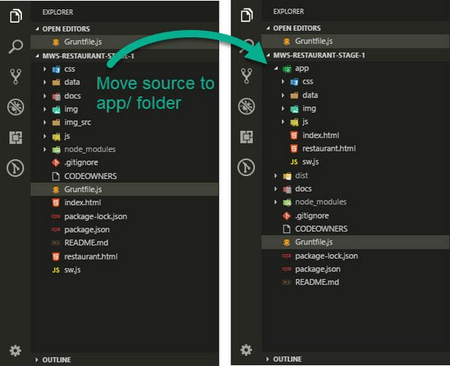](assets/images/2-5.jpg)
**Figure 5:** New Folder Structure

### 3.3 Update .gitignore
Along with the folder structure changes, I made an update to my `.gitignore` file.

```bash
# build, dist, & tmp directories
build/
dist/
tmp/
```

This prevents build or output folders from being copied to GitHub which is unnecessary since those folders (and files) will be created when the build tasks are run.

## 4. Fix Gruntfile
Changing the folder structure broke my old Grunt tasks. I wanted to fix that before moving on to Gulp.

### 4.1 My Original Build
In Stage 1, Grunt was designed to only to create a set of responsive images. This consisted of the following tasks:

- `clean` - Delete everything from the `img/` directory
- `responsive_images` - Take each image in `img_src/`, process at different resolutions (300, 400, 600, 800), and save to `img/` folder.

### 4.2 Copy Task
Since the files will be served from a new folder, I had to copy all non-processed files to the `dist/` folder.

This required a `copy` task to move css, js, & unprocessed image files.

```js
copy: {
  dev: {
    files: [
      { expand: true, cwd: 'app/', src: ['sw.js'], dest: 'dist/'},
      { expand: true, cwd: 'app/', src: ['css/*'], dest: 'dist/' },
      { expand: true, cwd: 'app/', src: ['js/*'], dest: 'dist/'},
      { expand: true, cwd: 'app/', src: ['img/fixed/*'], dest: 'dist/' }
    ]
  }
},
```

### 4.3 String Replace Task
Next, I moved my Google Maps API key out of my HTML files so it won't be visible, stolen, or used by someone else browsing my source code on GitHub.

I moved it to a file named `GM_API_KEY` and placed that file at the project root. I also updated `.gitignore` with this filename so it wouldn't be copied to GitHub.

```bash
# Google Maps API key
GM_API_KEY
```

Next, I added this task

```js
'string-replace': {
  dist: {
    files: [{
      expand: true, cwd: 'app/', src: ['*.html'], dest: 'dist/'
    }],
    options: {
      replacements: [{
        pattern: '<API_KEY_HERE>',
        replacement: '<%= grunt.file.read("GM_API_KEY") %>'
      }]
    }
  }
},
```

It looks in the `app/` folder for any HTML files and replaces `<API_KEY_HERE>` with the actual key value and then copies that to the `dist/` folder.

### 4.4 Final Gruntfile
The last steps were to update the existing `clean` and `responsive-images` tasks to use the new directory structure.

Here's the final `Gruntfile.js` configuration.

```js
module.exports = function(grunt) {

  grunt.initConfig({
    clean: {
      dev: {
        src: ['dist/*'],
      }
    },
    copy: {
      dev: {
        files: [
          { expand: true, cwd: 'app/', src: ['sw.js'], dest: 'dist/'},
          { expand: true, cwd: 'app/', src: ['css/*'], dest: 'dist/' },
          { expand: true, cwd: 'app/', src: ['js/*'], dest: 'dist/'},
          { expand: true, cwd: 'app/', src: ['img/fixed/*'], dest: 'dist/' }
        ]
      }
    },
    'string-replace': {
      dist: {
        files: [{
          expand: true, cwd: 'app/', src: ['*.html'], dest: 'dist/'
        }],
        options: {
          replacements: [{
            pattern: '<API_KEY_HERE>',
            replacement: '<%= grunt.file.read("GM_API_KEY") %>'
          }]
        }
      }
    },
    responsive_images: {
      dev: {
        options: {
          engine: 'gm',
          sizes: [
            {
              width: 300,
              quality: 40
            },
            {
              width: 400,
              quality: 40
            },
            {
              width: 600,
              quality: 40,
              suffix: '_2x'
            },
            {
              width: 800,
              quality: 40,
              suffix: '_2x'
            }
          ]
        },
        files: [{
          expand: true,
          cwd: 'app/img/',
          src: ['*.{gif,jpg,png}'],
          dest: 'dist/img/'
        }]
      }
    }
  });

  grunt.loadNpmTasks('grunt-contrib-clean');
  grunt.loadNpmTasks('grunt-contrib-copy');
  grunt.loadNpmTasks('grunt-string-replace');
  grunt.loadNpmTasks('grunt-responsive-images');
  
  grunt.registerTask('quick', ['copy', 'string-replace']);

  grunt.registerTask('default', ['clean', 'copy', 'string-replace',
    'responsive_images']);
};
  
```

## 5. Evaluate Build Tools
Before committing myself to one tool or another, I figured I should spend the time researching and evaluating what's available.

### 5.1 Old School Task Runners
There are a handful of build tools out there for web dev now. The original web dev build tools were referred to as Task Runners.

These became popular around 2014 and are still in wide use today. The the two with majority market share were Grunt and Gulp.

- [Grunt](https://gruntjs.com/) - Configuration-based task runner (simpler to config; more verbose)
- [Gulp](https://gulpjs.com/) - Code-based task runner (steeper learning, more condensed, faster exec)

### 5.2 Modern Bundlers
The next generation of web dev build tools were referred to as Bundlers. These do the same set of tasks as the Grunt and Gulp but are more streamlined for today's JavaScript frameworks.

Webpack is now the standard web dev/JavaScript bundler and is primarily used by the React team amongst others. The downside to webpack is complaints about it's documentation.

Parcel is quickly gaining attention for providing out of the box bundling with zero config.

- [Webpack](https://webpack.js.org) - Standard use in the big frameworks - React, Angular, Vue
- [Parcel](https://parceljs.org/) - Uses best practices for transforms, bundling, & code splitting
  
### 5.3 Conclusion
In the end I decided to go with Gulp since the [Web Tooling and Automation](https://www.udacity.com/course/web-tooling-automation--ud892) course associated with this nanodegree teaches that build system.

I figure whatever concepts I learn there are applicable to modern tools like Webpack and Parcel. It's like learning long division before working with a calculator.

## 6. Using Gulp
Settling on Gulp, I now had the choice of either using a scaffolding system or rolling my own gulpfile.

### 6.1 Scaffolding Options
The first thing I did was investigate scaffolding options.

Scaffolding is basically code generation. It consists of either using a pre-built code solution or using a generator that creates a baseline set of code files for use as a starting point.

It's a quick way to kickstart a project that conforms to a set of best practices.

The options I looked at were

- [Yeoman](http://yeoman.io)'s [Webapp generator](https://github.com/yeoman/generator-webapp)
- Google's [Web Starter Kit](https://developers.google.com/web/tools/starter-kit/)

These are great resources but I'm always hesitant to rely on generated code. 

The reason is that while generated code is quick and insulates you from having to understand the inner workings up front, it can quickly become a coding nightmare if you need to deviate from the norm.

If I need to customize the functionality then I usually lose any time saving benefits because I end up having to learn how to do it all anyways.

That said, a generated or pre-built solution is good to follow because chances are will use best coding practices & conventions.

In the end, I decided to roll up my sleeves and roll my own build solution.

I was able to use the gulpfile's & package.json's from Yeoman & Web Starter Kit as references though.

> #### Yeoman webapp generator
> - [gulpfile.js](https://github.com/yeoman/generator-webapp/blob/master/app/templates/gulpfile.js)
> - [ package.json](https://github.com/yeoman/generator-webapp/blob/master/app/templates/_package.json)
>
> #### Google Web Starter Kit
> - [gulpfile.js](https://github.com/yeoman/generator-webapp/blob/master/app/templates/gulpfile.js)
> - [package.json](https://github.com/google/web-starter-kit/blob/master/package.json)

### 6.2 Gulp Prep
The first thing I did was read through the following articles to get a sense of how tasks are constructed.

1. [Getting Started with Gulp](https://travismaynard.com/writing/getting-started-with-gulp)
2. [Gulp for Beginners](https://css-tricks.com/gulp-for-beginners/)
3. [How to automate all things with gulp](https://hackernoon.com/how-to-automate-all-the-things-with-gulp-b21a3fc96885)

The article that really stood out was #3 [How to automate all things with gulp](https://hackernoon.com/how-to-automate-all-the-things-with-gulp-b21a3fc96885).

This article walks you through creating a build process from start to finish. It also details a basic folder structure strategy using the following folders.

- `src/` or `app/` - source code
- `tmp/` - working dir from which a dev server will serve the linted & bundled files
- `dist/` - production ready & minified bits

### 6.3 Basic config
Following the same article [How to automate all things with gulp](https://hackernoon.com/how-to-automate-all-the-things-with-gulp-b21a3fc96885), I proceeded to create a basic configuration.

This does the following

- defines `src/`, `tmp/`, & `dist/` paths
- creates `clean`, `copy`, `build`, `serve`, & `watch` tasks

The complete gulpfile is below.

```js
var gulp = require('gulp');
var del = require('del');
var fs = require('fs');
var replace = require('gulp-string-replace');
var browserSync = require('browser-sync').create();

var paths = {
  src: 'app/**/*',
  srcHTML: 'app/**/*.html',
  srcCSS: 'app/**/*.css',
  srcJS: 'app/**/*.js',

  tmp: 'tmp', // tmp folder
  tmpIndex: 'tmp/index.html', // index.html in tmp folder
  tmpCSS: 'tmp/**/*.css', // css files in tmp folder
  tmpJS: 'tmp/**/*.js', // js files in tmp folder

  dist: 'dist',
  distIndex: 'dist/index.html',
  distCSS: 'dist/**/*.css',
  distJS: 'dist/**/*.js'
};

// build
gulp.task('default', ['copy', 'js']);

// serve & watch
gulp.task('serve', function () {
  browserSync.init({
    server: paths.tmp,
    port: 8000
  });
  
  gulp.watch(paths.srcJS, ['js-watch']);
});

// build, serve, & watch
gulp.task('serve:build', ['copy', 'js', 'serve']);

// this task ensures the `js` task is complete before reloading browsers
gulp.task('js-watch', ['js'], function (done) {
  browserSync.reload();
  done();
});

// Clean output directory
gulp.task('clean', function () {
  del(['tmp/*', 'dist/*']); // del files rather than dirs to avoid error
});

// HTML
gulp.task('html', function () {
  var apiKey = fs.readFileSync('GM_API_KEY', 'utf8');

  return gulp.src(paths.srcHTML)
    .pipe(replace('<API_KEY_HERE>', apiKey))
    .pipe(gulp.dest(paths.tmp));
});
// CSS
gulp.task('css', function () {
  return gulp.src(paths.srcCSS)
    .pipe(gulp.dest(paths.tmp));
});
// JS
gulp.task('js', function () {
  return gulp.src(paths.srcJS)
    .pipe(gulp.dest(paths.tmp));
});

gulp.task('copy', ['html', 'css', 'js']);
```

I can now do the following.

- `gulp` - default task that builds the site: code is placed in `tmp/`
- `gulp serve` - spins up the dev server and watches for changes to `.js` files
- `gulp serve:build` - combines previous two tasks; builds the site & serves it

[](assets/images/2-6.jpg)
**Figure 6:** Gulp Build

### 6.4 Lint & Transpile
Now that the basics of my build system were in place, I expanded the scope of my tasks.

To begin with I wanted to lint my code on every build to eliminate syntax errors and enforce best coding practices. This was done with a set of linting rules I defined.

Next, I wanted to make sure my ES6 code runs across all major browsers. This is done through a transpiler and a set of rules defining which browsers I'm targeting.

I used ESLint for linting and Babel for transpiling.

> #### Lint & Transpile Tools
> - [Babel](https://babeljs.io/docs/en) - is a JavaScript compiler used to convert code into a backwards compatible version of JavaScript for old browsers or environments.
> - [ESLint](https://eslint.org/docs/user-guide/getting-started) - provides static analysis of JavaScript used to find syntax errors, problematic patterns, or code that doesn’t adhere to certain style guidelines.

#### Install Packages
The first thing I did was install the necessary packages.

```bash
npm install gulp-eslint gulp-babel babel-core babel-preset-env --save-dev
```

Here's what each do.

- `gulp-eslint` - gulp plugin version of ESLint
- `gulp-babel` - gulp plugin version of Babel
- `babel-core` - core engine
- `babel-preset-env` - set of preset rules

#### Configure ESLint
Next I configured ESLint by answering a set of questions from the command line at my project root with this command.

```bash
eslint --init
```

That produced an `.eslintrc.js` file with some basic configuration. I modified the "rules" section to meet my needs.

```js
module.exports = {
    "env": {
        "browser": true,
        "commonjs": true,
        "es6": true
    },
    "extends": "eslint:recommended",
    // "extends": "google",
    "parserOptions": {
        "sourceType": "module"
    },
    "rules": {
        "indent": [
            "error",
            2
        ],
        // "quotes": 0
        "quotes": [
            "warn",
            "single"
        ],
        "semi": [
            "error",
            "always"
        ],
        "no-console": "off",
        "no-unused-vars": "warn",
        "no-undef": "warn",
        "no-useless-escape": "warn"
    }
};
```

Additional linting rules can be set by looking them up here: [ESLint Rules](https://eslint.org/docs/rules/).

#### Configure Babel
Next, I created a somewhat elaborate `.babelrc` file according to the logic spelled out here: [Three browsers holding JavaScript back the most](https://twitter.com/jamiebuilds/status/1022568918949408768).

I basically states that the default browser list ([http://browserl.ist/?q=defaults](http://browserl.ist/?q=defaults)) supports 89.79% of all browsers with 23 Babel transforms.

The currated browserlist below ([http://browserl.ist/?q=+%3E+0.05%2...](http://browserl.ist/?q=+%3E+0.05%25%2C+not+dead%2C+not+ie+11%2C+not+android+4.1%2C+not+android+4.2%2C+not+android+4.4%2C+not+android+4.4.3%2C+not+chrome+29%2C+not+chrome+43%2C+not+chrome+49%2C+not+chrome+54%2C+not+firefox+47%2C+not+firefox+48%2C+not+firefox+51%2C+not+firefox+52%2C+not+ios+8.1%2C+not+ios+9.3%2C+not+safari+5.1%2C+not+safari+9.1%2C)) supports 88.35% of all browsers while retaining ES6 syntax with only 6 Babel transforms.

```js
{
  "presets": [
    // ["env", {
    //   "targets": {
    //     "browsers": [
    //       "> 2%",  // outputs es5 cause IE11 has 2.71% market share
    //       "not dead"
    //     ]
    //   }
    // }]
    // ["env", {
    //   "targets": {
    //     "browsers": [
    //       "> 3%",  // outputs es6 cause IE11 has 2.71% market share
    //       "not dead"
    //     ]
    //   }
    // }]
    ["env", {
      "targets": {
        "browsers": [
          "> 0.05%",
          "not dead",
          "not ie 11",
          "not android 4.1",
          "not android 4.2",
          "not android 4.4",
          "not android 4.4.3",
          "not chrome 29",
          "not chrome 43",
          "not chrome 49",
          "not chrome 54",
          "not firefox 47",
          "not firefox 48",
          "not firefox 51",
          "not firefox 52",
          "not ios 8.1",
          "not ios 9.3",
          "not safari 5.1",
          "not safari 9.1"
        ]
      }
    }]
  ]
}
```

This matters because transpiled code has a cost.

- More code
- Which is slower to parse
- And slower to execute
- Debugging is harder
- Compiling takes longer
- And all this stacks to transform even more modern features

Here's a link to the [browserlist GitHub Repo](https://github.com/browserslist/browserslist) that explains how to construct the list.

#### Configure Gulp

Then I updated my gulpfile.js with the following.

```js
var babel = require('gulp-babel');
var eslint = require('gulp-eslint');

// JS
gulp.task('js', function () {
  return gulp.src(paths.srcJS)
    .pipe(babel())                  // transpiles js
    .pipe(uglify())                 // minifies js
    .pipe(size({title: 'scripts'})) // outputs file size to console
    .pipe(gulp.dest(paths.tmp));
});
```

I then run gulp with the following command.

```bash
gulp
```

I then get the following output.

[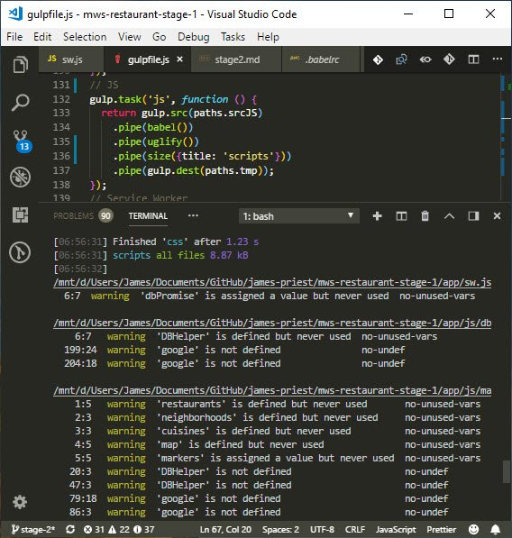](assets/images/2-7.jpg)
**Figure 7:** Gulp Build

This shows me two things.

- All code warnings associated to linting.
- The final size for scripts at 8.87 kB down from 20.5 kb.

### 6.5 Transform & Bundle
The next thing I had to do was figure out was how to transpile and bundle my JavaScript.

In this case, I had to reference a separate [IndexedDB Promised (idb)](https://github.com/jakearchibald/idb) module in my `sw.js` file.

The `idb` module written by Jake Archibald wraps the browser's native IndexedDB API with Promises to simplify the handling of asynchronous events.

Since this is an external library, we may reference it in one of many ways including AMD, CommonJS, & ES6 modules. For a quick primer read this.

- [A 10 minute primer to JavaScript modules, module formats, module loaders and module bundlers](https://www.jvandemo.com/a-10-minute-primer-to-javascript-modules-module-formats-module-loaders-and-module-bundlers/)

In short, the two most common ways to reference a module or library is with CommonJS (`require` syntax) or ES6 (`import` syntax).

#### ES5 CommonJS syntax (require)

```js
// ES5 CommonJS syntax used in Node.js
let idb = require('idb');
```

#### ES6 modules syntax (import)

```js
// ES6 module format with import syntax
import idb from 'idb';
```

Now in order to have Jake's module bundled with our code we need to rely on a module bundler.

A bundler runs at build time and as the name suggests, it bundles your script files together into one file.

Examples of popular module bundlers are:

- [Browserify](http://browserify.org/): bundler for CommonJS modules
- [Webpack](https://webpack.github.io/): bundler for AMD, CommonJS, ES6 modules

Since we're using Gulp, we will rely on Browserify to do our bundling.

> **NOTE:** When using Webpack or Parcel, the bundling is handled for you in a much simpler and more straightforward way.
>
> For that reason many folks have moved on to use one of those systems.
>
> With Gulp we have to manually configure our bundling with a set of 4-6 plugins to achieve this.

Here's the code so you can see what it looks like. We'll unpack it below.

#### gulpfile.js

```js
var gulp = require('gulp');
var browserify = require('browserify');
var babelify = require('babelify');
var source = require('vinyl-source-stream');
var buffer = require('vinyl-buffer');
var uglify = require('gulp-uglify-es').default; // ES6
var size = require('gulp-size');

var paths = {
  tmp: 'tmp', // tmp folder
}

gulp.task('sw', function () {
  var bundler = browserify('./app/sw.js'); // ['1.js', '2.js']

  return bundler
    .transform(babelify)    // required for ES6 'import' syntax
    .bundle()               // combine code
    .pipe(source('sw.js'))  // get text stream; set destination filename
    .pipe(buffer())         // required to use stream w/ other plugin
    .pipe(uglify())         // condense & minify
    .pipe(size())           // outputs file size to console
    .pipe(gulp.dest(paths.tmp));
});
```

Here we are doing the following:

1. Call `browserify` passing in source JavaScript and assign result to `bundler`
2. Invoke `transform` method passing in `babilify` to transpile ES6 syntax
3. `bundle` combines the code into a single file text stream
4. `source` gets the text stream and emits a single file instance
5. `buffer` converts streaming vinyl file to use buffers for piping to other plugins
6. `uglify` condenses and minifies the JavaScript
7. `size` is unnecessary but nice to see the new file size output to console
8. `gulp.dest` saves the file to the path specified

Here's a list of resources to see other examples.

#### Medium Articles
- [Browserify, Babelify and ES6](http://egorsmirnov.me/2015/05/25/browserify-babelify-and-es6.html)
- [Getting import/export working ES6 style using Browserify + Babelify + Gulp = -5hrs of life](https://medium.com/@hey.aaron/getting-import-export-working-es6-style-using-browserify-babelify-gulp-5hrs-of-life-eca7786e44cc)

#### NPM Packages
- [vinyl-source-stream](https://www.npmjs.com/package/vinyl-source-stream) (with basic example)
- [vinyl-buffer](https://www.npmjs.com/package/vinyl-buffer) (with basic example)

### 6.6 Responsive Images
This task required transforming & optimizing each source image into four separate sized images for use in the responsive design of the site.

I used a package called `gulp-responsive` and added the following tasks

```js
// Build responsive images
var gulp = require('gulp');
var $ = require('gulp-load-plugins')();

gulp.task('images', ['fixed-images'], function () {
  return gulp.src('app/img/*.jpg')
    .pipe($.responsive({
      '*.jpg': [
        { width: 300, rename: { suffix: '-300' }, },
        { width: 400, rename: { suffix: '-400' }, },
        { width: 600, rename: { suffix: '-600_2x' }, },
        { width: 800, rename: { suffix: '-800_2x' }, }
      ]
    }, {
      quality: 40,
      progressive: true,
      withMetadata: false,
    }))
    .pipe(gulp.dest('.tmp/img'))
    .pipe(gulp.dest('dist/img'));
});

// Copy fixed images
gulp.task('fixed-images', function () {
  return gulp.src('app/img/fixed/**')
    .pipe(gulp.dest('.tmp/img/fixed'))
    .pipe(gulp.dest('dist/img/fixed'));
});
```

When the task is run it produces the following output.

[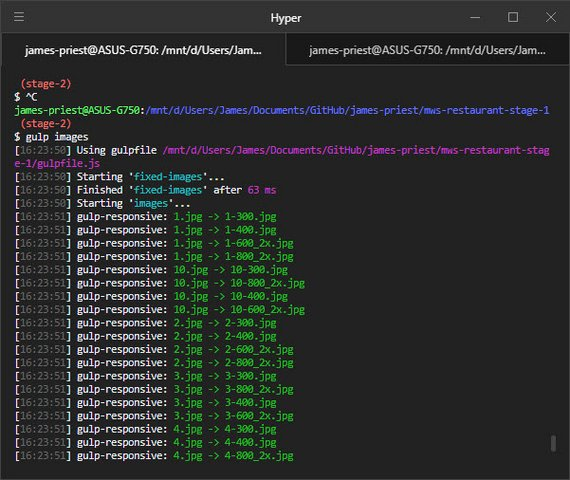](assets/images/2-8.jpg)
**Figure 8:** Responsive Images Task

### 6.7 Concat & Optimize
The next plugin I used is called `gulp-useref` and it scans your html to determine your CSS & script files. It then concatenates & optimizes them and updates the references in your html.

The HTML starts out like this:

```html
  <!-- build:css css/styles.css -->
  <link rel="stylesheet" href="css/styles.css">
  <!-- endbuild -->

  <!-- build:js js/index.min.js defer -->
  <script src="js/dbhelper.js"></script>
  <script src="js/register_sw.js"></script>
  <script src="js/main.js"></script>
  <!-- endbuild -->
```

It then concatenates & optimizes the code and produces the following html.

```html
  <link rel=stylesheet href=css/styles.css>

  <script src=js/index.min.js defer></script>
```

The optimizations can include:

- bundle
- minify
- sourcemaps
- autoprefixing
- sass
- es2015 transpiling

Here's the task for my dev build

```js
// Prep assets for dev
gulp.task('html', function () {
  var apiKey = fs.readFileSync('GM_API_KEY', 'utf8');

  return gulp.src('app/*.html')
    .pipe($.stringReplace('<API_KEY_HERE>', apiKey))
    .pipe($.useref())
    .pipe($.if('*.css', $.autoprefixer()))
    .pipe($.if('*.js', $.babel()))
    .pipe($.if('*.html', $.htmlmin({
      removeComments: true,
      collapseBooleanAttributes: true,
      removeAttributeQuotes: true,
      removeRedundantAttributes: true,
      removeEmptyAttributes: true,
      removeScriptTypeAttributes: true,
      removeStyleLinkTypeAttributes: true,
      removeOptionalTags: true
    })))

    .pipe(gulp.dest('.tmp'));
});
```

The task for my production build contains a few more optimizations

```js
// Scan HTML for js & css and optimize them
gulp.task('html:dist', function () {
  var apiKey = fs.readFileSync('GM_API_KEY', 'utf8');

  return gulp.src('app/*.html')
    .pipe($.stringReplace('<API_KEY_HERE>', apiKey))
    .pipe($.size({title: 'html (before)'}))
    .pipe($.useref({},
      lazypipe().pipe($.sourcemaps.init)
      // lazypipe().pipe(babel) // no coz css
      // transforms assets before concat
    ))
    .pipe($.if('*.css', $.size({ title: 'styles (before)' })))
    .pipe($.if('*.css', $.cssnano()))
    .pipe($.if('*.css', $.size({ title: 'styles (after) ' })))
    .pipe($.if('*.css', $.autoprefixer()))
    .pipe($.if('*.js', $.babel()))
    .pipe($.if('*.js', $.size({title: 'scripts (before)'})))
    .pipe($.if('*.js', $.uglifyEs.default()))
    .pipe($.if('*.js', $.size({title: 'scripts (after) '})))
    .pipe($.sourcemaps.write('.'))
    .pipe($.if('*.html', $.htmlmin({
      removeComments: true,
      collapseWhitespace: true,
      collapseBooleanAttributes: true,
      removeAttributeQuotes: true,
      removeRedundantAttributes: true,
      minifyJS: {compress: {drop_console: true}},
      removeEmptyAttributes: true,
      removeScriptTypeAttributes: true,
      removeStyleLinkTypeAttributes: true,
      removeOptionalTags: true
    })))

    .pipe($.if('*.html', $.size({ title: 'html (after) ', showFiles: false })))
    .pipe(gulp.dest('dist'));
});
```

This ended up replacing my previous `styles` and `scripts` tasks since `useref` will do it all in one go.

Once done I can run `gulp html` or `gulp html:dist`

[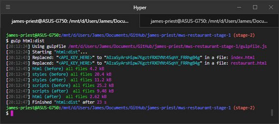](assets/images/2-9.jpg)
**Figure 9:** HTML, Scripts, & Styles Task

### 6.8 Build & Serve
The final part of this build system involved serving the pages and providing live reload on code changes.

This was done with a plugin called `browsersync`.

The other thing I did was create three main tasks. These are:

- `gulp serve` - creates a development server with live reload

    The scripts & stylesheets are processed and concatenated before being copied to `.tmp`. Images are processed & copied along with the html. Once there the site is served uncompressed and without optimization for quick development.
- `gulp serve:dist` - optimizes code and create a preview for a production build
- `gulp` - builds a production ready site without spinning up a server

The code looks like this:

```js
// Watch files for changes & reload
gulp.task('serve', function () {
  runSequence(['clean'], ['images', 'lint', 'html', 'sw'], function() {
    browserSync.init({
      server: '.tmp',
      port: 8001
    });

    gulp.watch(['app/*.html'], ['html', reload]);
    gulp.watch(['app/css/*.css'], ['html', reload]);
    gulp.watch(['app/js/*.js'], ['lint', 'html', reload]);
    gulp.watch(['app/sw.js'], ['lint', 'sw', reload]);
  });
});

// Build and serve the fully optimized site
gulp.task('serve:dist', ['default'], function () {
  browserSync.init({
    server: 'dist',
    port: 8000
  });

  gulp.watch(['app/*.html'], ['html:dist', reload]);
  gulp.watch(['app/css/*.css'], ['html:dist', reload]);
  gulp.watch(['app/js/*.js'], ['lint', 'html:dist', reload]);
  gulp.watch(['app/sw.js'], ['lint', 'sw', reload]);
});

// Build production files, the default task
gulp.task('default', ['clean:dist'], function (done) {
  runSequence(['images', 'lint', 'html:dist', 'sw:dist'], done);
});
```

When I run either `gulp serve` I get the following output showing linting warnings, build times, & statistics.

[](assets/images/2-11.jpg)
**Figure 11:** Gulp output

Eventually when the build is done, I get browsersync reporting the internal and external URLs available for the site.

[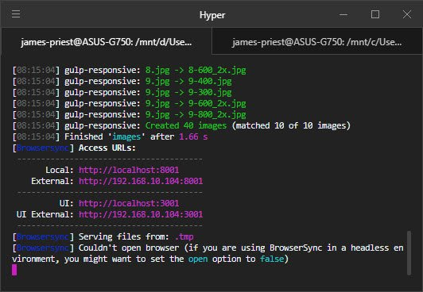](assets/images/2-12.jpg)
**Figure 12:** Browsersync Info

#### New Gulpfile structure

Ideally, it would have been nice to be able to use either *[Yeoman's webapp generator](https://github.com/yeoman/generator-webapp)* or *[Google's Web Starter Kit](https://developers.google.com/web/tools/starter-kit/)* as an out-of-the-box build system solution, but two requirements made that not workable.

1. Needed to preprocess (inject) Google Maps API key in HTML for the site to work
2. Ability to process ES6 (import statements) as part of my build process

I did use both of the projects below as reference when building out the structure of my build solution.

> #### Yeoman webapp generator
> - [gulpfile.js](https://github.com/yeoman/generator-webapp/blob/master/app/templates/gulpfile.js)
> - [ package.json](https://github.com/yeoman/generator-webapp/blob/master/app/templates/_package.json)
> - [GitHub Repo](https://github.com/yeoman/generator-webapp)
>
> #### Google Web Starter Kit
> - [gulpfile.js](https://github.com/yeoman/generator-webapp/blob/master/app/templates/gulpfile.js)
> - [package.json](https://github.com/google/web-starter-kit/blob/master/package.json)
> - [Website](https://developers.google.com/web/tools/starter-kit/)

It was necessary to follow this path rather than the more simplified solution I had originally started as outlined by following this article:

- [How to automate all things with Gulp](https://hackernoon.com/how-to-automate-all-the-things-with-gulp-b21a3fc96885)

While the article was great in giving a structure and context to each of the plugins and build tasks, it didn't quite fit the need.

When all was said and done, I had close to 30 plugins in use.

[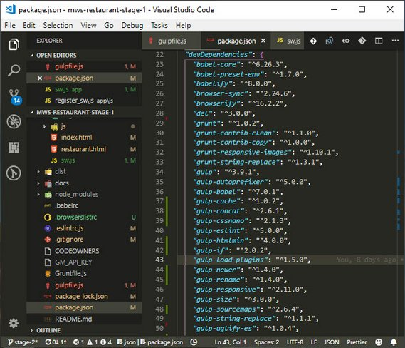](assets/images/2-10.jpg)
**Figure 10:** package.json

#### Completed gulpfile build script
Now I can efficiently lint, bundle, transpile, concatenate, minify, autoprefix, & optimize my code on every save.

This is now done automatically, and allows me to spend more time writing code.

The final gulpfile.js looks like this.

```js
var gulp = require('gulp');
var gulpLoadPlugins = require('gulp-load-plugins')
var fs = require('fs');
var del = require('del');
var browserify = require('browserify');
var babelify = require('babelify');
var source = require('vinyl-source-stream');
var buffer = require('vinyl-buffer');
var runSequence = require('run-sequence');
var lazypipe = require('lazypipe');
var browserSync = require('browser-sync').create();

var $ = gulpLoadPlugins();
var reload = browserSync.reload;

// Lint JavaScript
gulp.task('lint', function () {
  return gulp.src(['app/**/*.js', '!node_modules/**'])
    .pipe($.eslint())
    .pipe($.eslint.format())
    .pipe($.eslint.failOnError());
});

// Build responsive images
gulp.task('images', ['fixed-images'], function () {
  return gulp.src('app/img/*.jpg')
    .pipe($.responsive({
      '*.jpg': [
        { width: 300, rename: { suffix: '-300' }, },
        { width: 400, rename: { suffix: '-400' }, },
        { width: 600, rename: { suffix: '-600_2x' }, },
        { width: 800, rename: { suffix: '-800_2x' }, }
      ]
    }, {
      quality: 40,
      progressive: true,
      withMetadata: false,
    }))
    .pipe(gulp.dest('.tmp/img'))
    .pipe(gulp.dest('dist/img'));
});

// Copy fixed images
gulp.task('fixed-images', function () {
  return gulp.src('app/img/fixed/**')
    .pipe(gulp.dest('.tmp/img/fixed'))
    .pipe(gulp.dest('dist/img/fixed'));
});

// Prep assets for dev
gulp.task('html', function () {
  var apiKey = fs.readFileSync('GM_API_KEY', 'utf8');

  return gulp.src('app/*.html')
    .pipe($.stringReplace('<API_KEY_HERE>', apiKey))
    .pipe($.useref())
    .pipe($.if('*.css', $.autoprefixer()))
    .pipe($.if('*.js', $.babel()))
    .pipe($.if('*.html', $.htmlmin({
      removeComments: true,
      collapseBooleanAttributes: true,
      removeAttributeQuotes: true,
      removeRedundantAttributes: true,
      removeEmptyAttributes: true,
      removeScriptTypeAttributes: true,
      removeStyleLinkTypeAttributes: true,
      removeOptionalTags: true
    })))

    .pipe(gulp.dest('.tmp'));
});

// Scan HTML for js & css and optimize them
gulp.task('html:dist', function () {
  var apiKey = fs.readFileSync('GM_API_KEY', 'utf8');

  return gulp.src('app/*.html')
    .pipe($.stringReplace('<API_KEY_HERE>', apiKey))
    .pipe($.size({title: 'html (before)'}))
    .pipe($.useref({},
      lazypipe().pipe($.sourcemaps.init)
      // lazypipe().pipe(babel) // no coz css
      // transforms assets before concat
    ))
    .pipe($.if('*.css', $.size({ title: 'styles (before)' })))
    .pipe($.if('*.css', $.cssnano()))
    .pipe($.if('*.css', $.size({ title: 'styles (after) ' })))
    .pipe($.if('*.css', $.autoprefixer()))
    .pipe($.if('*.js', $.babel()))
    .pipe($.if('*.js', $.size({title: 'scripts (before)'})))
    .pipe($.if('*.js', $.uglifyEs.default()))
    .pipe($.if('*.js', $.size({title: 'scripts (after) '})))
    .pipe($.sourcemaps.write('.'))
    .pipe($.if('*.html', $.htmlmin({
      removeComments: true,
      collapseWhitespace: true,
      collapseBooleanAttributes: true,
      removeAttributeQuotes: true,
      removeRedundantAttributes: true,
      minifyJS: {compress: {drop_console: true}},
      removeEmptyAttributes: true,
      removeScriptTypeAttributes: true,
      removeStyleLinkTypeAttributes: true,
      removeOptionalTags: true
    })))

    .pipe($.if('*.html', $.size({ title: 'html (after) ', showFiles: false })))
    .pipe(gulp.dest('dist'));
});

// Process Service Worker
gulp.task('sw', function () {
  var bundler = browserify('./app/sw.js', {debug: true}); // ['1.js', '2.js']

  return bundler
    .transform(babelify, {sourceMaps: true})  // required for 'import'
    .bundle()               // concat
    .pipe(source('sw.js'))  // get text stream w/ destination filename
    .pipe(buffer())         // required to use stream w/ other plugins
    .pipe(gulp.dest('.tmp'));
});

// Optimize Service Worker
gulp.task('sw:dist', function () {
  var bundler = browserify('./app/sw.js', {debug: true}); // ['1.js', '2.js']

  return bundler
    .transform(babelify, {sourceMaps: true})  // required for 'import'
    .bundle()               // concat
    .pipe(source('sw.js'))  // get text stream w/ destination filename
    .pipe(buffer())         // required to use stream w/ other plugins
    .pipe($.size({ title: 'Service Worker (before)' }))
    .pipe($.sourcemaps.init({loadMaps: true}))
    .pipe($.uglifyEs.default())         // minify
    .pipe($.size({title: 'Service Worker (after) '}))
    .pipe($.sourcemaps.write('./'))
    .pipe(gulp.dest('dist'));
});

// Clean temp directory
gulp.task('clean', function () {
  return del(['.tmp/**/*']); // del files rather than dirs to avoid error
});

// Clean output directory
gulp.task('clean:dist', function () {
  return del(['dist/**/*']); // del files rather than dirs to avoid error
});

// Watch files for changes & reload
gulp.task('serve', function () {
  runSequence(['clean'], ['images', 'lint', 'html', 'sw'], function() {
    browserSync.init({
      server: '.tmp',
      port: 8001
    });

    gulp.watch(['app/*.html'], ['html', reload]);
    gulp.watch(['app/css/*.css'], ['html', reload]);
    gulp.watch(['app/js/*.js'], ['lint', 'html', reload]);
    gulp.watch(['app/sw.js'], ['lint', 'sw', reload]);
  });
});

// Build and serve the fully optimized site
gulp.task('serve:dist', ['default'], function () {
  browserSync.init({
    server: 'dist',
    port: 8000
  });

  gulp.watch(['app/*.html'], ['html:dist', reload]);
  gulp.watch(['app/css/*.css'], ['html:dist', reload]);
  gulp.watch(['app/js/*.js'], ['lint', 'html:dist', reload]);
  gulp.watch(['app/sw.js'], ['lint', 'sw', reload]);
});

// Build production files, the default task
gulp.task('default', ['clean:dist'], function (done) {
  runSequence(['images', 'lint', 'html:dist', 'sw:dist'], done);
});
```

In all this took a solid five days to create, test, and fine-tune.

It originally had twice as much code and went through many iterations before being reduced to the essentials.

Overall it was a great exercise in rolling my own build system before moving to something more automated such as Webpack or Parcel.

## 7. SW with IndexedDB
### 7.1 IDBPromise library
The instruction was:

> "Make sure the client application works offline."
> 
> "JSON responses are cached using the IndexedDB API. Any data previously accessed while connected is reachable while offline."

The first thing I did was check out Jake Archibald's [IndexedDB Promise library](https://github.com/jakearchibald/idb).

This replaces the `IDBRequest` objects with promises to allow chaining and better management of asynchronous operations.

I first set up a constant called `dbPromise` which is assigned the results of the `idb.open` operation.

```js
const dbPromise = idb.open('udacity-restaurant-db', 1, upgradeDB => {
  switch (upgradeDB.oldVersion) {
    case 0:
      upgradeDB.createObjectStore('restaurants');
  }
});
```

I then used the following code as a starting point for getting and setting to the IDB object store.

```js
// IndexedDB object with get & set methods
// https://github.com/jakearchibald/idb
const idbKeyVal = {
  get(key) {
    return dbPromise.then(db => {
      return db
        .transaction('restaurants')
        .objectStore('restaurants')
        .get(key);
    });
  },
  set(key, val) {
    return dbPromise.then(db => {
      const tx = db.transaction('restaurants', 'readwrite');
      tx.objectStore('restaurants').put(val, key);
      return tx.complete;
    });
  }
};
```

### 7.2 Modify fetch handler
Next I took my original intercept fetch handler which save my app resources to cache and modified it to also save site data to IndexedDB.

This allows the site to still function even when offline.

#### Original Code
Here's an edited version of the original code

```js
self.addEventListener('fetch', event => {
  event.respondWith(
    // Add cache.put to cache images on each fetch
    caches.match(event.request).then(response => {
      return response || fetch(event.request).then(fetchResponse => {
        return caches.open(staticCacheName).then(cache => {
          // filter out browser-sync resources otherwise it will err
          if (!fetchResponse.url.includes('browser-sync')) { // prevent err
            cache.put(event.request, fetchResponse.clone());
          }
          return fetchResponse;
        });
      });
    }).catch(error => new Response(error));
  );
});
```

#### Updated handler
This new handler now tests if the request is for data (port 1337) or resources and it directs to the appropriate function.

```js
self.addEventListener('fetch', event => {
  const request = event.request;
  const requestUrl = new URL(request.url);

  if (requestUrl.port === '1337') {
    event.respondWith(idbResponse(request));
  }
  else {
    event.respondWith(cacheResponse(request));
  }
});
```

### 7.3 Create Cache function
Next I took the previous cache handler code and place it in a new `cacheResponse` function.

#### Cache handler

```js
function cacheResponse(request) {
  // match request...
  return caches.match(request)
    .then(response => {
    // return matched response OR if no match then
    // fetch, open cache, cache.put response.clone, return response
      return 
        response || 
        fetch(request).then(fetchResponse => {
          return caches.open(staticCacheName).then(cache => {
            // filter out browser-sync resources otherwise it will err
            if (!fetchResponse.url.includes('browser-sync')) { // prevent err
              cache.put(request, fetchResponse.clone()); // put clone in cache
            }
            return fetchResponse; // send original back to browser
          });
      });
  }).catch(error => new Response(error));
}
```

### 7.4 Create IDB function
Lastly, I placed the IndexedDB code into it's own function.

This is the new code that first tries to get the data from the IDB object store. If it doesn't get a match then it

- fetches data
- saves to object store
- returns data as json

#### IDB handler

```js
function idbResponse(request) {
  return idbKeyVal.get('restaurants')
    .then(restaurants => {
      return (
        restaurants ||
        fetch(request)
          .then(response => response.json())
          .then(json => {
            idbKeyVal.set('restaurants', json);
            return json;
          })
      );
    })
    .then(response => new Response(JSON.stringify(response)))
    .catch(error => {
      return new Response(error, {
        status: 404,
        statusText: 'my bad request'
      });
    });
}
```

This straight-forward and readable code took days to get to this concise state. It was much longer and more convoluted.

Writing clean or elegant code is tough.

### 7.5 Test Offline
Once I place this code, I can look in DevTools under the Applications tab to verify that all got saved to the IndexedDB database properly.

#### Verify Data
[](assets/images/2-13.jpg)
**Figure 13:** `udacity-restaurant-db` object store

The next step is to throttle the network and test that the data is still available.

#### Network Throttling
This can be done in DevTools by opening the Network Conditions tab and then setting Network Throttling to "Offline".

[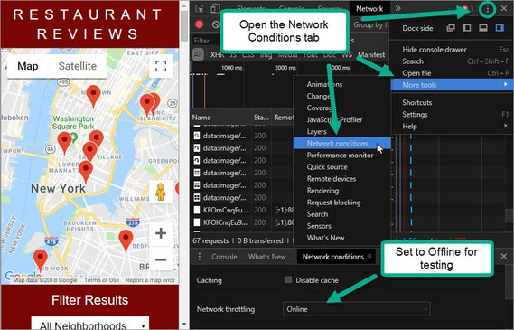](assets/images/2-14.jpg)
**Figure 14:** DevTools Network Conditions tab

#### Test Offline
Now we can click through the site and see that the data is still populating the page.

[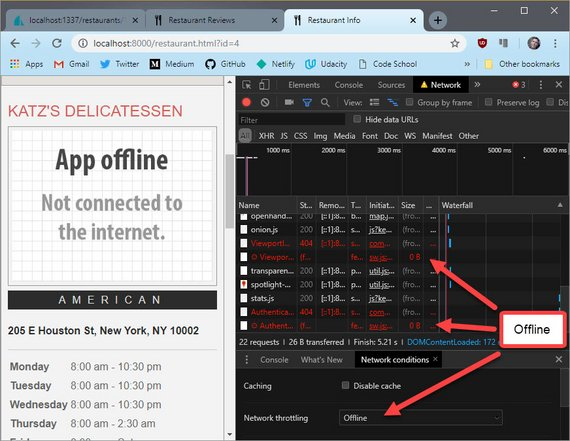](assets/images/2-15.jpg)
**Figure 15:** Data visible when offline

We even see a temporary placeholder image for images that haven't been cached yet.

Once I remove throttling I now see the image and the map come into view.

> **NOTE:** If the page was previously visited then the image and the map will already be in Cache and the user will effectively have the same experience as they would with a active internet.

[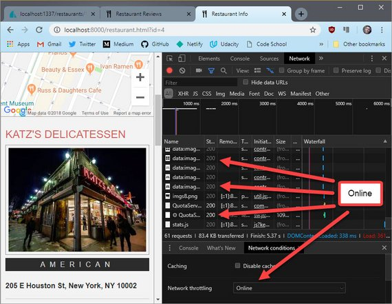](assets/images/2-16.jpg)
**Figure 16:** Images visible when online

### 7.6 Run Audits
The next step is to run DevTools Audits. My project needs to score above the following numbers.

| Test | Score |
| --- | --- |
| Progressive Web Apps | > 90 |
| Performance | > 70 |
| Accessibility | > 90 |

#### Use Optimized Build
One thing I needed to do was audit off of the optimized site.

In order to do this I needed to shut down my gulp dev build server and serve the distribution build.

This is done with the following command.

```bash
gulp serve:dist
```

Once gulp generates and serves the site it is accessed at `http://localhost:8000`.

#### Audits panel
You can select the audits you'd like to execute and then click the Run audits button.

[](assets/images/2-17.jpg)
**Figure 17:** Audits panel

#### Audits Results
The results are then shown after all the tests are run. These consist of clearing the cache, testing performance, accessibility & PWA status.

[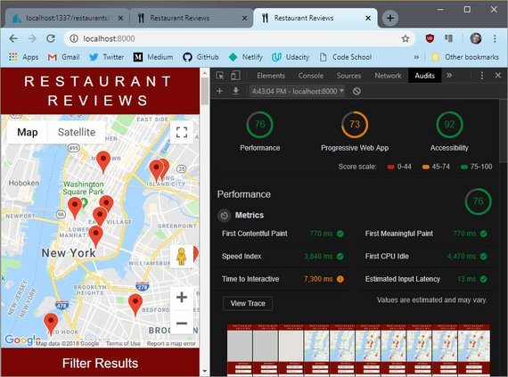](assets/images/2-18.jpg)
**Figure 18:** Audits results

I am now in compliance with two of the three tests. Here's the a close up of the results

[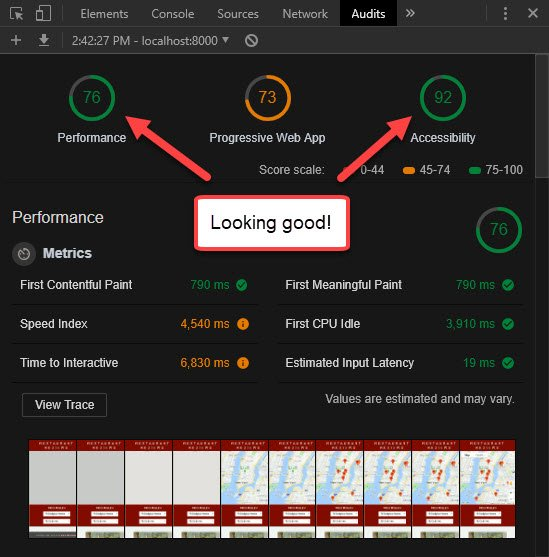](assets/images/2-19.jpg)
**Figure 19:** Audits results close-up

Only one more to go!

## 8. Progressive Web App
### 8.1 Review PWA Audit
The first thing I did was run Google DevTools Lighthouse audits.  This can be found in the Audits tab.

You can make sure to just check the "Progressive Web App" audit option.

[](assets/images/2-17.jpg)
**Figure 17:** Audits panel

Once the audit completed it showed a score and a checklist of items that can be improved.

[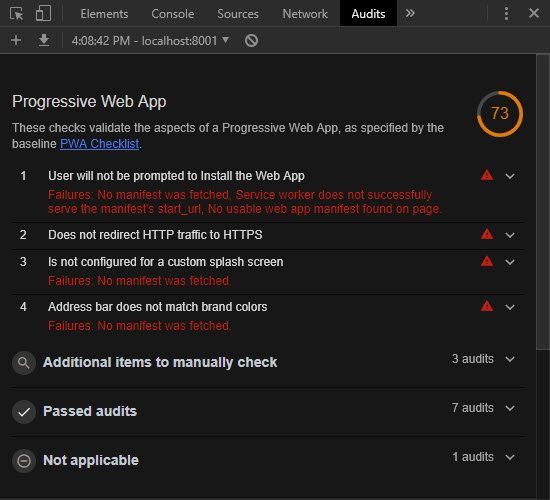](assets/images/2-20.jpg)
**Figure 20:** PWA Audits Result

I then went through the check list and googled each to see how to improve.

### 8.2 Web App Manifest
The first item required me to learn about the Web App Manifest.  I did this at Google's Developer Fundamentals site.

- [Google Web Fundamentals - Web App Manifest](https://developers.google.com/web/fundamentals/web-app-manifest/)

The next thing was to generate a Web App Manifest. This was done easily through a generator provided by firebase.

- [Web App Manifest Generator](https://app-manifest.firebaseapp.com/)

I also provided an icon file which the generator packages up into a downloadable zip.

[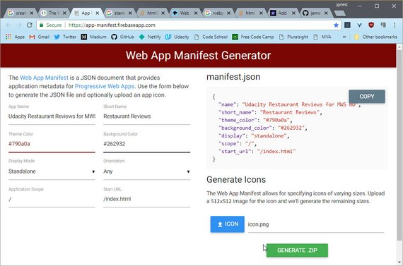](assets/images/2-21.jpg)
**Figure 21:** Web App Manifest Generator

I then placed the manifest in the root of the `app/` directory, and updated the links to the icon files within the manifest. All icons were copied to the `/img/fixed/` directory.

Next I added the following lines to each html file.

```html
<html>
  <link rel="manifest" href="manifest.json">
  <link rel="icon" sizes="32x32" href="img/fixed/icon.png">
  <meta name="theme-color" content="#790a0a"/>
  <!-- More html -->
```

### 8.3 Update Gulp
Now that we have some new files to account for I had to update the Gulp build system so that these files get copied to both `.tmp/` and `dist/`.

I added a new `manifest` task.

```js

// Copy manifest
gulp.task('manifest', function () {
  return gulp.src('app/manifest.json')
    .pipe(gulp.dest('.tmp/'))
    .pipe(gulp.dest('dist/'));
});
```

I then had to add the manifest task into the list of tasks that get executed for each type of build.

The updated build code is below.

```js
// Watch files for changes & reload
gulp.task('serve', function () {
  runSequence(['clean'], ['images', 'lint', 'html', 'sw', 'manifest'],
  function() {
    browserSync.init({
      server: '.tmp',
      port: 8001
    });

    gulp.watch(['app/*.html'], ['html', reload]);
    gulp.watch(['app/css/*.css'], ['html', reload]);
    gulp.watch(['app/js/*.js'], ['lint', 'html', reload]);
    gulp.watch(['app/sw.js'], ['lint', 'sw', reload]);
    gulp.watch(['app/manifest.json'], ['manifest', reload]);
  });
});

// Build and serve the fully optimized site
gulp.task('serve:dist', ['default'], function () {
  browserSync.init({
    server: 'dist',
    port: 8000
  });

  gulp.watch(['app/*.html'], ['html:dist', reload]);
  gulp.watch(['app/css/*.css'], ['html:dist', reload]);
  gulp.watch(['app/js/*.js'], ['lint', 'html:dist', reload]);
  gulp.watch(['app/sw.js'], ['lint', 'sw', reload]);
  gulp.watch(['app/manifest.json'], ['manifest', reload]);
});

// Build production files, the default task
gulp.task('default', ['clean:dist'], function (done) {
  runSequence(['images', 'lint', 'html:dist', 'sw:dist', 'manifest'], done);
});
```

### 8.4 Rerun Audit
Now that the manifest is in place and the HTML is updated, I ran the audit once more.

This time the score was a 92!

[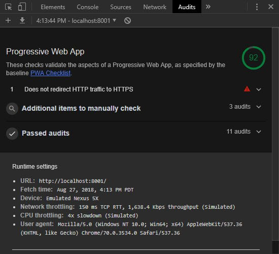](assets/images/2-22.jpg)
**Figure 22:** Web App Manifest Generator

## 9. Stage 2 Review
### 9.1 Update README
The next thing I did was create specific instructions for my reviewer to be able to run the project.

This included adding steps to to the README that explained how to build and run the project.

These steps include the following:

> #### Mobile Web Specialist Certification Course
>
> ##### Restaurant App Stage 2 - client app
> Stage 1 required that a simple HTTP server be run manually in order to view and test the project. Stage 2 includes a build system that will automatically serve the optimized site.
>
> Two things must happen to run this project:
> 1. Create a file containing a valid Google Maps API key
> 2. Run the build system which will serve the optimized site
>
> ##### Google API Key
> A file named GM_API_KEY needs to be created in the root folder (\) with a valid Google Maps API key.
>
> ##### Serve optimized site
> Run the following command to build & serve the optimized site.
>
> ```bash
> gulp serve:dist
> ```
>
> This will start the server at `http://localhost:8000`.
>
> ##### Build System
> If you want to develop you can use the following commands.
>
> **Start the dev server**
>
> ```bash
> gulp serve
> ```
>
> This will start the server at `http://localhost:8001`.
>
> Changes can be made to the files in the app/ directory. The browser will reload the changes on each file save.
>
> **Build & Optimize**
>
> ```bash
> gulp
> ```
>
> This will build and optimize the project ready for deployment. It will output to the dist/ folder

### 9.2 Submit Project
I then pushed all my changes to GitHub and submitted my project for review.

I sent the reviewer my Google Maps API key and then waited...

### 9.3 Review Results
The review came back later that evening.


[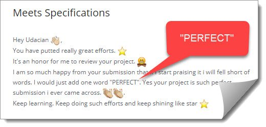](assets/images/2-24.jpg)
**Figure 23:** Meets Specifications

The review then showed the Audit scores I received.

[](assets/images/2-23.jpg)
**Figure 24:** Audit Scores

I took an extra week to finish the assignment but it was well worth it. I was able to pass on the first attempt and received a wonderful review!