<!-- markdownlint-disable MD022 MD032 -->
# Code Notes

[<-- back to Restaurant Review Code Notes homepage](index.html)

---

### Requirements
Here are the requirements for Stage 3:
- Setup the REST server / review new end points
- Create Favorite toggle control
- Create Review form
- Bind new data to controls
- Cache new data to IDB
- Save review data when offline / Post when back online 
- Ensure Lighthouse performance benchmarks meet the following:
  - **Progressive Web App** - 90 or better
  - **Performance** - 90 or better
  - **Accessibility** - 90 or better

## 1. Stage 3 Prep
### 1.1 Fork & Clone Repo
The first thing to do was fork the [mws-restaurant-stage-3](https://github.com/udacity/mws-restaurant-stage-3) starter project.

This is a Local Development API Server and will not be the project we'll be working on. Instead, we spin this server up and continue extending the  work on our stage-1 project.

- Stage-1 consists of the front-end
- Stage-2 is a back end dev server that provides the API services our app will consume
- Stage-3 is another version of the back end server that provides additional API services for our app to consume

### 1.2 Install Dependencies
Read README.md. It describes the following steps to install all npm dependencies and spin up the server.

#### Install Global Dependencies
This should have been done from stage 2 but if it wasn't then run the command below.

```bash
npm install sails -g
```

#### Install Project Dependencies
Next install all project dependencies. This will install all packages that are detailed in the `packages.json` project file.

```bash
npm install
```

### 1.3 Start Server
You can then start the server with the following command.

```bash
node server
```

## 2. Ajax, Fetch & Endpoints
### 2.0 API Endpoints
View the MWS-Restaurant-Stage-3 [README.md]((https://github.com/james-priest/mws-restaurant-stage-3#endpoints)) in order to see each of the API Endpoints

#### GET Endpoints
- Get all restaurants
  - `http://localhost:1337/restaurants/`
- Get favorite restaurants
  - `http://localhost:1337/restaurants/?is_favorite=true`
- Get a restaurant by id
  - `http://localhost:1337/restaurants/<restaurant_id>`
- Get all reviews for a restaurant
  - `http://localhost:1337/reviews/?restaurant_id=<restaurant_id>`
- Get all restaurant reviews
  - `http://localhost:1337/reviews/`
- Get a restaurant review by id
  - `http://localhost:1337/reviews/<review_id>`

#### POST Endpoints
- Create a new restaurant review
  - `http://localhost:1337/reviews/`
  - Parameters
  ```bash
  {
      "restaurant_id": <restaurant_id>,
      "name": <reviewer_name>,
      "rating": <rating>,
      "comments": <comment_text>
  }
  ```

#### PUT Endpoints
- Favorite a restaurant
  - `http://localhost:1337/restaurants/<restaurant_id>/?is_favorite=true`
- Unfavorite a restaurant
  - `http://localhost:1337/restaurants/<restaurant_id>/?is_favorite=false`
- Update a restaurant review
  - `http://localhost:1337/reviews/<review_id>`
  - Parameters
  ```bash
  {
      "name": <reviewer_name>,
      "rating": <rating>,
      "comments": <comment_text>
  }
  ```

#### DELETE Endpoints
- Delete a restaurant review
  - `http://localhost:1337/reviews/<review_id>`

### 2.1 API Usage
The API can be tested in a few different ways. Here's what the README shows in terms of usage.

#### Usage
##### Get Restaurants

```bash
curl "http://localhost:1337/restaurants/"
```

##### Get Restaurants by id

```bash
curl "http://localhost:1337/restaurants/{3}"
```

### 2.2 Test API
There are a few different ways to test whether the API is working properly.

You can use
- Browser URL
- Fetch in Console
- Ajax Test App

### 2.3. Test API: Browser
A quick and dirty way to test is to copy the url into the url bar of your browser.

[](assets/images/2-1.jpg)
**Figure 1:** Browser URL

### 2.4. Test API: DevTools
You can also write a `fetch` request right in the console of your browser.

[](assets/images/2-2.jpg)
**Figure 2:** DevTools Fetch Call

You might have to use `<SHIFT>` + `<ENTER>` in order to skip lines without submitting the code.

What is initially returned is a Promise in *pending* state. Once the promise resolves the results should output to the console immediately afterwards.

You'll need to click the arrow to expand the array.

> **NOTE:** For security reasons you can only `fetch` from the same domain. Meaning you can't fetch data from `http://unsplash.com` if you are on `http://google.com`.
>
> Also note that if the Promise does not resolve with output to the console, you may need to refresh the page and try again.

[](assets/images/2-3.jpg)
**Figure 3:** DevTools Fetch Results

Here is the fetch code.

```js
fetch('http://localhost:1337/restaurants')
  .then(r => r.json())
  .then(data => console.log(data))
  .catch(e => console.log("Booo"))
```

### 2.5. Test API: Ajax App
You can use an app like Postman to really test all permutations of an Ajax call.

This is a good option if need to really test and understand what is returned in a complex Web API.

Here is the output of a restaurant call

[](assets/images/2-4.jpg)
**Figure 4:** Postman App

The advantage of an app like this is

1. You don't need to write complex code in the console to make it work. Just submit your fetch string as the request
2. The response is color coded and easier to read than browser output.

## 3. Favorite Control
### 3.1 Create Rollover Image
The first step was to grab a png of a heart to use as a favorite icon on the toggle button.

I copied the heart image two more time and varied the color. The states are as follows:

- On
- Off
- Hover

[](assets/images/3-1.jpg)<br>
**Figure 1:** Rollover PNG

### 3.2 Create Toggle Control
This image is then used as a background to a div created dynamically through JavaScript.

We first create the `<div>` element and then add the proper ARIA attributes. such as `aria-label`, `role='button'`, & `aria-pressed` attributes.

We also create the event handler.

#### main.js

```js
const createRestaurantHTML = (restaurant) => {
  const li = document.createElement('li');

  const fav = document.createElement('button');
  fav.className = 'fav-control';
  fav.setAttribute('aria-label', 'favorite');
  if (restaurant.is_favorite === 'true') {
    fav.classList.add('active');
    fav.setAttribute('aria-pressed', 'true');
    fav.innerHTML = `Remove ${restaurant.name} as a favorite`;
    fav.title = `Remove ${restaurant.name} as a favorite`;
  } else {
    fav.setAttribute('aria-pressed', 'false');
    fav.innerHTML = `Add ${restaurant.name} as a favorite`;
    fav.title = `Add ${restaurant.name} as a favorite`;
  }
  fav.addEventListener('click', (evt) => {
    evt.preventDefault();
    if (fav.classList.contains('active')) {
      fav.setAttribute('aria-pressed', 'false');
      fav.innerHTML = `Add ${restaurant.name} as a favorite`;
      fav.title = `Add ${restaurant.name} as a favorite`;
      DBHelper.unMarkFavorite(restaurant.id);
    } else {
      fav.setAttribute('aria-pressed', 'true');
      fav.innerHTML = `Remove ${restaurant.name} as a favorite`;
      fav.title = `Remove ${restaurant.name} as a favorite`;
      DBHelper.markFavorite(restaurant.id);
    }
    fav.classList.toggle('active');
  });
  li.append(fav);

  // more code
}
```

Next I had to include the favorite control on the details page as well.

This was done with both HTML and JavaScript

#### restaurant.html

```html
<div id="restaurant-img-container">
  <button id="restaurant-fav" aria-label="favorite"></button>
  
</div>
```

#### restaurant_info.js

```js
const fillRestaurantHTML = (restaurant = self.restaurant) => {
  const name = document.getElementById('restaurant-name');
  name.innerHTML = restaurant.name;

  const address = document.getElementById('restaurant-address');
  address.innerHTML = restaurant.address;

  const favorite = document.getElementById('restaurant-fav');
  if (restaurant.is_favorite === 'true') {
    favorite.classList.add('active');
    favorite.setAttribute('aria-pressed', 'true');
    favorite.innerHTML = `Remove ${restaurant.name} as a favorite`;
    favorite.title = `Remove ${restaurant.name} as a favorite`;
  } else {
    favorite.setAttribute('aria-pressed', 'false');
    favorite.innerHTML = `Add ${restaurant.name} as a favorite`;
    favorite.title = `Add ${restaurant.name} as a favorite`;
  }
  favorite.addEventListener('click', (evt) => {
    evt.preventDefault();
    if (favorite.classList.contains('active')) {
      favorite.setAttribute('aria-pressed', 'false');
      favorite.innerHTML = `Add ${restaurant.name} as a favorite`;
      favorite.title = `Add ${restaurant.name} as a favorite`;
      DBHelper.unMarkFavorite(restaurant.id);
    } else {
      favorite.setAttribute('aria-pressed', 'true');
      favorite.innerHTML = `Remove ${restaurant.name} as a favorite`;
      favorite.title = `Remove ${restaurant.name} as a favorite`;
      DBHelper.markFavorite(restaurant.id);
    }
    favorite.classList.toggle('active');
  });

  // more code
}
```

### 3.3 Create CSS
The css accounts for the control placement, size, & rollover effects.

This is the CSS for both the index page and the detail page.

#### styles.css

```css
#restaurants-list .fav-control {
  background-color: white;
  width: 44px;
  height: 40px;
  position: absolute;
  align-self: flex-end;
  margin-top: 6px;
  margin-left: -6px;
  padding: 5px;
  border: 1px solid #999;
  border: 4px double #999;
  background-image: url('../img/fixed/favorite5.png');
  background-repeat: no-repeat;
  background-position: 6px -26px;
  background-size: 24px;
  cursor: pointer;
  text-indent: -10000px;
}
#restaurants-list .fav-control.active  {
  background-position: 6px 5px;
}
#restaurants-list .fav-control:hover {
  background-position: 6px -59px;
}

#restaurant-img-container {
  display: flex;
  flex-direction: column;
}
#restaurant-fav {
  background-color: white;
  width: 44px;
  height: 40px;
  position: absolute;
  align-self: flex-end;
  margin-top: 6px;
  margin-left: -6px;
  padding: 5px;
  border: 1px solid #999;
  border: 4px double #999;
  background-image: url('../img/fixed/favorite5.png');
  background-repeat: no-repeat;
  background-position: 6px -27px;
  background-size: 24px;
  cursor: pointer;
  text-indent: -10000px;
}
#restaurant-fav.active {
  background-position: 6px 5px;
}
#restaurant-fav:hover {
  background-position: 6px -59px;
}
```

### 3.4 Create DB code
Next I created the Ajax code in the `dbhelper.js` file.

#### dbhelper.js

```js
// http://localhost:1337/restaurants/<restaurant_id>/?is_favorite=true
static markFavorite(id) {
  fetch(`${DBHelper.DATABASE_URL}/restaurants/${id}/?is_favorite=true`, {
    method: 'PUT'
  });
}

// http://localhost:1337/restaurants/<restaurant_id>/?is_favorite=false
static unMarkFavorite(id) {
  fetch(`${DBHelper.DATABASE_URL}/restaurants/${id}/?is_favorite=false`, {
    method: 'PUT'
  });
}
```

### 3.5 Test Favorite Toggle
Once this was done I tested it on both the index and details pages.

[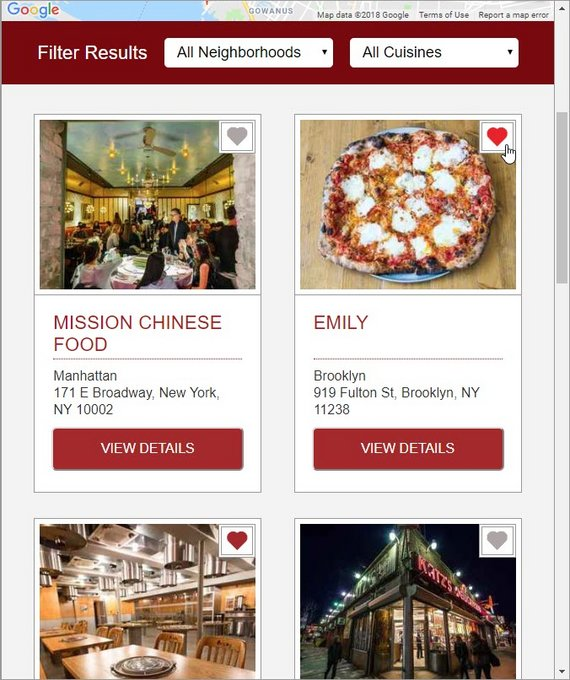](assets/images/3-2.jpg)
**Figure 2:** Favorite Control

Testing consisted of clicking the toggle button to make sure the control's class is updated appropriately and then viewing the database to make sure the record is updated properly.

[](assets/images/3-3.jpg)
**Figure 3:** Favorite API

## 4. Restaurant Reviews
### 4.1 Display Reviews
I had to change three files in order to get the Reviews to display properly.

- dbhelper.js
- restaurant_info.js
- styles.css

#### dbhelper.js
Added a new method to grab all reviews by restaurant id.

```js
  static fetchRestaurantReviewsById(id, callback) {
    fetch(DBHelper.DATABASE_URL + `/reviews/?restaurant_id=${id}`)
      .then(response => response.json())
      .then(data => callback(null, data))
      .catch(err => callback(err, null));
  }
```

#### restaurant_info.js
Added this call to the `fillRestaurantHTML` method

```js
DBHelper.fetchRestaurantReviewsById(restaurant.id, fillReviewsHTML);
```

Then modified the `fillReviewsHTML` callback method to work with the returned data from `dbhelper.js` file.

```js
const fillReviewsHTML = (error, reviews) => {
  self.restaurant.reviews = reviews;

  if (error) {
    console.log('Error retrieving reviews', error);
  }

  // more code...
}
```

Add additional code the the `createReviewHTML` method.

```js
const createReviewHTML = (review) => {
  const li = document.createElement('li');
  const name = document.createElement('p');
  name.innerHTML = review.name;
  li.appendChild(name);

  const createdAt = document.createElement('p');
  createdAt.classList.add('createdAt');
  const createdDate = new Date(review.createdAt).toLocaleDateString();
  createdAt.innerHTML = `Added:<strong>${createdDate}</strong>`;
  li.appendChild(createdAt);

  const updatedAt = document.createElement('p');
  const updatedDate = new Date(review.updatedAt).toLocaleDateString();
  updatedAt.innerHTML = `Updated:<strong>${updatedDate}</strong>`;
  updatedAt.classList.add('updatedAt');
  li.appendChild(updatedAt);

  const rating = document.createElement('p');
  rating.classList.add('rating');
  rating.innerHTML = `Rating: ${review.rating}`;
  rating.dataset.rating = review.rating;
  li.appendChild(rating);

  const comments = document.createElement('p');
  comments.classList.add('comments');
  comments.innerHTML = review.comments;
  li.appendChild(comments);

  return li;
};
```

#### restaurant.html
Added a `<div id='reviews-header'></div>` to the html...

```html
<section id="reviews-container" aria-label="Reviews">
  <div id="reviews-header"></div>
  <ul id="reviews-list"></ul>
</section>
```

#### styles.css
Added these review display classes.

```css
#reviews-header {
  display: flex;
  align-items: flex-start;
  justify-content: space-between;
}
#reviews-list li p.createdAt {
  float: right;
}
#reviews-list li p.updatedAt {
  float: right;
  color: #008800;
  clear: both;
}
#reviews-list li p.rating {
  float: left;
}
#reviews-list li p.comments {
  clear: both;
}
```

Once the code is in place the reviews should display like this.

[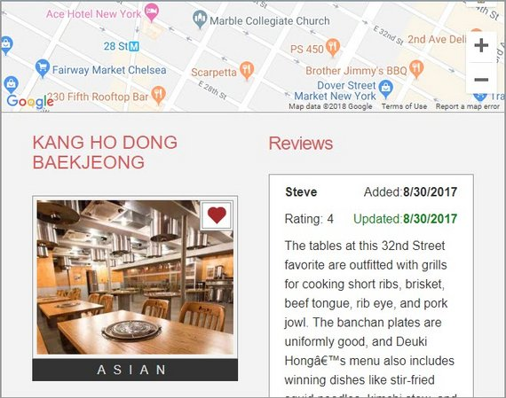](assets/images/3-4.jpg)
**Figure 4:** Reviews

### 4.2 Create a Modal Popup
The first step in creating an "Add Review" form is to create the modal popup that will contain the form.

I start this by creating a `<div id="modal"></div>` right under the body tag in the `restaurant.html` file.

#### restaurant.html

```html
<body class="inside">
  <div id="modal">
    <button class="close-btn" onclick="toggleModal(event)" aria-label="close"
            title="Close">x</button>
    <div id="review-form"></div>
  </div>
```

I then add a `<div id="reviews-header"></div>` to the `reviews-container` section element. This will contain the "Add Review" button justified right of the Reviews header .

```html
<section id="reviews-container" aria-label="Reviews">
  <div id="reviews-header"></div>
  <ul id="reviews-list"></ul>
</section>
```

Next, I update the `restaurant_info.js` file. The first thing to do is add the modal control.

#### restaurant_info.js

```js
const toggleModal = (evt) => {
  evt.preventDefault();
  const modal = document.getElementById('modal');
  modal.classList.toggle('show');
};
```

The next thing I do is update the `fillReviewsHTML` method.

```js
const fillReviewsHTML = (error, reviews) => {
  self.restaurant.reviews = reviews;

  if (error) {
    console.log('Error retrieving reviews', error);
  }
  const header = document.getElementById('reviews-header');

  const title = document.createElement('h2');
  title.innerHTML = 'Reviews';
  header.appendChild(title);
  
  const addReview = document.createElement('button');
  addReview.classList.add('review-add-btn');
  addReview.innerHTML = '+';
  addReview.setAttribute('aria-label', 'add review');
  addReview.title = 'Add Review';
  addReview.addEventListener('click', toggleModal);
  header.appendChild(addReview);
  
  const container = document.getElementById('reviews-container');
  if (!reviews) {
    const noReviews = document.createElement('p');
    noReviews.innerHTML = 'No reviews yet!';
    container.appendChild(noReviews);
    return;
  }
  const ul = document.getElementById('reviews-list');
  reviews.forEach(review => {
    ul.appendChild(createReviewHTML(review));
  });
  container.appendChild(ul);
};
```

Lastly, I updated the CSS with the appropriate styles to ensure the modal dialog always aligns and centers itself properly.

This was done by following a tip on CSS Tricks ([CSS Tricks Styling a Modal](https://css-tricks.com/considerations-styling-modal/ )).

I also added styling for the "Add Review" button and the "Close" button on the modal form.

```css
#reviews-header {
  display: flex;
  align-items: flex-start;
  justify-content: space-between;
}
#reviews-container .review-add-btn {
  padding: 0 8px;
  font-size: 1.6em;
  cursor: pointer;
}
#modal {
  /* begin css tricks */
  position: fixed;
  top: 50%;
  left: 50%;
  transform: translate(-50%, -50%);
  /* end css tricks */
  z-index: -10;
  display: flex;
  flex-direction: column;
  width: 80vw;
  height: 80vh;
  border: 1px solid #666;
  border-radius: 10px;
  opacity: 0;
  transition: all .3s;
  overflow: hidden;
  background-color: #eee;
}
#modal.show {
  opacity: 1;
  z-index: 10;
}
#modal .close-btn {
  align-self: flex-end;
  font-size: 1.6em;
  margin: 8px;
  padding: 0 8px;
  cursor: pointer;
}
#review-form {
  width: 100%;
  padding: 20px 26px;
  color: #333;
  overflow-y: auto;
}
```

The initial "Add Review" button is added to the right of the Review header.

[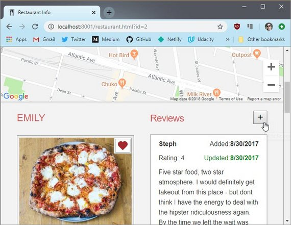](assets/images/3-5.jpg)
**Figure 5:** Add Review Button

When we click the button, a perfectly centered modal popup animates open using the css `transition` property.

[](assets/images/3-6.jpg)
**Figure 6:** Add Review Model Popup

We also use this same transition to animate the modal closed when the "Close" button is clicked.

## 5. Add Review Form
### 5.1 List of Changes
I performed quite a few modifications to the app so far.  I did these in stages but will list all out here as a group. This includes the following:

#### Improved the modal pop-up
- Popup now centers itself properly
- Employs a modal-overlay that grays out all non-modal page elements
- Improved CSS treatment for cleaner look and better accessibility. Now has
  - rounded corners
  - 16px font-size
  - large 48px wide tap targets

#### Add Review Form
- Traps keyboard navigation so that ESC exits and TAB or SHIFT+TAB navigates
- Includes a star rating control based on standard HTML radio input
- Includes proper ARIA and accessibility labels and roles
- Includes form validation

### 5.2 HTML Updates

#### restaurant.html

```html
<!-- Beginning modal -->
<div id="modal" role="dialog" aria-modal="true"
  aria-labelledby="add-review-header">
  <button class="close-btn" aria-label="close" title="Close">x</button>
  <div id="review-form-container">
    <h2 id="add-review-header">Add Review</h2>
    <form id="review-form">
      <div class="fieldset">
        <label for="reviewName">Name</label>
        <input type="text" name="reviewName" id="reviewName" required>
      </div>
      <div class="fieldset">
        <label>Rating</label>
        <div class="rate">
          <input type="radio" id="star5" name="rate" value="5"
            onkeydown="navRadioGroup(event)"
            onfocus="setFocus(event)" required />
          <label for="star5" title="5 stars">5 stars</label>
          <input type="radio" id="star4" name="rate" value="4"
            onkeydown="navRadioGroup(event)" />
          <label for="star4" title="4 stars">4 stars</label>
          <input type="radio" id="star3" name="rate" value="3"
            onkeydown="navRadioGroup(event)" />
          <label for="star3" title="3 stars">3 stars</label>
          <input type="radio" id="star2" name="rate" value="2"
            onkeydown="navRadioGroup(event)" />
          <label for="star2" title="2 stars">2 stars</label>
          <input type="radio" id="star1" name="rate" value="1"
            onkeydown="navRadioGroup(event)" onfocus="setFocus(event)" />
          <label for="star1" title="1 star">1 star</label>
        </div>
      </div>
      <div class="fieldset">
        <label for="reviewComments">Comments</label>
        <textarea name="reviewComments" id="reviewComments"
          cols="20" rows="5" required></textarea>
      </div>
      <div class="fieldset right">
        <button id="submit-review-btn">Save</button>
      </div>
    </form>
  </div>
</div>
<div class="modal-overlay"></div>
<!-- End modal -->
```

### 5.3 CSS Updates

#### styles.css

```css
/* ====================== Review Form ====================== */
#modal {
  /* fix exactly center: https://css-tricks.com/considerations-styling-modal/ */
  /* begin css tricks */
  position: fixed;
  top: 50%;
  left: 50%;
  transform: translate(-50%, -50%);
  /* end css tricks */
  z-index: 3;
  display: flex;
  flex-direction: column;
  border: 1px solid #666;
  border-radius: 10px;
  opacity: 0;
  transition: all .3s;
  overflow: hidden;
  background-color: #eee;
  display: none;
}
#modal.show {
  opacity: 1;
  display: flex
}
.modal-overlay {
  width: 100%;
  height: 100%;
  z-index: 2; /* places the modalOverlay between main page and modal dialog */
  background-color: #000;
  opacity: 0;
  transition: all .3s;
  position: fixed;
  top: 0;
  left: 0;
  display: none;
  margin: 0;
  padding: 0;
}
.modal-overlay.show {
  display: block;
  opacity: 0.5;  
}
#modal .close-btn {
  align-self: flex-end;
  font-size: 1.4em;
  margin: 8px 8px 0;
  padding: 0 8px;
  cursor: pointer;
}
form {
  max-width: 900px;
  padding: 0 20px 20px 20px;
}
input, select, .rate, textarea, button {
  background: #f9f9f9;
  border: 1px solid #e5e5e5;
  border-radius: 8px;
  box-shadow: inset 0 1px 1px #e1e1e1;
  font-size: 16px;
  padding: 8px;
}
input[type="radio"] {
  box-shadow: none;
}
button {
  min-width: 48px;
  min-height: 48px;
}
button:hover {
  border: 1px solid #ccc;
  background-color: #fff;
}
button#review-add-btn, 
button.close-btn, 
button#submit-review-btn {
  min-height: 40px;
}
button#submit-review-btn {
  font-weight: bold;
  cursor: pointer;
  padding: 0 16px;
}

.fieldset {
  margin-top: 20px;
}
.right {
  align-self: flex-end;
}
#review-form-container {
  width: 100%;
  padding: 0 20px 26px;
  color: #333;
  overflow-y: auto;
}
#review-form-container h2 {
  margin: 0 0 0 6px;
}
#review-form {
  display: flex;
  flex-direction: column;
  background: #fff;
  border: 1px solid #e5e5e5;
  border-radius: 4px;
}
#review-form label, #review-form input {
  display: block;
}
#review-form label {
  font-weight: bold;
  margin-bottom: 5px;
}

#review-form .rate label, #review-form .rate input,
#review-form .rate1 label, #review-form .rate1 input {
  display: inline-block;
}
/* Modified from: https://codepen.io/tammykimkim/pen/yegZRw */
.rate {
  height: 36px;
  display: inline-flex;
  flex-direction: row-reverse;
  align-items: flex-start;
  justify-content: flex-end;
}
#review-form .rate > label {
  margin-bottom: 0;
  margin-top: -5px;
  height: 30px;
}
.rate:not(:checked) > input {
  top: -9999px;
  margin-left: -24px;
  width: 20px;
  padding-right: 14px;
  z-index: -10;
}
.rate:not(:checked) > label {
  float:right;
  width:1em;
  overflow:hidden;
  white-space:nowrap;
  cursor:pointer;
  font-size:30px;
  color:#ccc;
}
.rate:not(:checked) > label::before {
  content: '★ ';
  position: relative;
  top: -10px;
  left: 2px;
}
.rate > input:checked ~ label {
  color: #ffc700;
}
.rate > input:checked:focus + label, .rate > input:focus + label {
  outline: -webkit-focus-ring-color auto 5px;
}
.rate:not(:checked) > label:hover,
.rate:not(:checked) > label:hover ~ label {
  color: #deb217;
}
.rate > input:checked + label:hover,
.rate > input:checked + label:hover ~ label,
.rate > input:checked ~ label:hover,
.rate > input:checked ~ label:hover ~ label,
.rate > label:hover ~ input:checked ~ label {
  color: #c59b08;
}
#submit-review {
  align-self: flex-end;
}
```

### 5.4 JS Updates

#### restaurant_info.js

```js
var focusedElementBeforeModal;
const modal = document.getElementById('modal');
const modalOverlay = document.querySelector('.modal-overlay');

// Adapted from modal dialog sample code in Udacity Web Accessibility course 891
const openModal = () => {
  // Save current focus
  focusedElementBeforeModal = document.activeElement;

  // Listen for and trap the keyboard
  modal.addEventListener('keydown', trapTabKey);

  // Listen for indicators to close the modal
  modalOverlay.addEventListener('click', closeModal);
  // Close btn
  const closeBtn = document.querySelector('.close-btn');
  closeBtn.addEventListener('click', closeModal);

  // submit form
  const form = document.getElementById('review-form');
  form.addEventListener('submit', saveAddReview, false);

  // Find all focusable children
  var focusableElementsString = 'a[href], area[href], input:not([disabled]),' +
    'select:not([disabled]), textarea:not([disabled]), button:not([disabled]),' + 
    'iframe, object, embed, [tabindex="0"], [contenteditable]';
  var focusableElements = modal.querySelectorAll(focusableElementsString);
  // Convert NodeList to Array
  focusableElements = Array.prototype.slice.call(focusableElements);

  var firstTabStop = focusableElements[0];
  var lastTabStop = focusableElements[focusableElements.length - 1];

  // Show the modal and overlay
  modal.classList.add('show');
  modalOverlay.classList.add('show');

  // Focus first child
  // firstTabStop.focus();
  const reviewName = document.getElementById('reviewName');
  reviewName.focus();

  function trapTabKey(e) {
    // Check for TAB key press
    if (e.keyCode === 9) {

      // SHIFT + TAB
      if (e.shiftKey) {
        if (document.activeElement === firstTabStop) {
          e.preventDefault();
          lastTabStop.focus();
        }

      // TAB
      } else {
        if (document.activeElement === lastTabStop) {
          e.preventDefault();
          firstTabStop.focus();
        }
      }
    }

    // ESCAPE
    if (e.keyCode === 27) {
      closeModal();
    }
  }
};

const saveAddReview = (e) => {
  e.preventDefault();

  const name = document.querySelector('#reviewName').value;
  const rating = document.querySelector('input[name=rate]:checked').value;
  const comments = document.querySelector('#reviewComments').value;
  
  // console.log(name);
  // console.log(rating);
  // console.log(comments);

  DBHelper.createRestaurantReview(self.restaurant.id, name, rating, comments,
    (error, review) => {
    console.log('got callback');
    if (error) {
      console.log('Error saving review');
    } else {
      // do some other stuff
      console.log(review);
      window.location.href = `/restaurant.html?id=${self.restaurant.id}`;
    }
  });
};

const closeModal = () => {
  // Hide the modal and overlay
  modal.classList.remove('show');
  modalOverlay.classList.remove('show');

  const form = document.getElementById('review-form');
  form.reset();
  // Set focus back to element that had it before the modal was opened
  focusedElementBeforeModal.focus();
};

const setFocus = (evt) => {
  const rateRadios = document.getElementsByName('rate');
  const rateRadiosArr = Array.from(rateRadios);
  const anyChecked = rateRadiosArr.some(radio => { 
    return radio.checked === true; 
  });
  if (!anyChecked) {
    const star1 = document.getElementById('star1');
    star1.focus();
  }
};

// this code is done for proper a11y & keyboard nav
const navRadioGroup = (evt) => {
  const star1 = document.getElementById('star1');  
  const star2 = document.getElementById('star2');  
  const star3 = document.getElementById('star3');  
  const star4 = document.getElementById('star4');  
  const star5 = document.getElementById('star5');  

  if (['ArrowRight', 'ArrowLeft', 'ArrowDown', 'ArrowUp'].includes(evt.key)) {
    evt.preventDefault();
    // console.log('attempting return');
    if (evt.key === 'ArrowRight' || evt.key === 'ArrowDown') {
      switch(evt.target.id) {
        case 'star1':
          star2.focus();
          star2.checked = true;
          break;
        case 'star2':
          star3.focus();
          star3.checked = true;
          break;
        case 'star3':
          star4.focus();
          star4.checked = true;
          break;
        case 'star4':
          star5.focus();
          star5.checked = true;
          break;
        case 'star5':
          star1.focus();
          star1.checked = true;
          break;
      }
    } else if (evt.key === 'ArrowLeft' || evt.key === 'ArrowUp') {
      switch(evt.target.id) {
        case 'star1':
          star5.focus();
          star5.checked = true;
          break;
        case 'star2':
          star1.focus();
          star1.checked = true;
          break;
        case 'star3':
          star2.focus();
          star2.checked = true;
          break;
        case 'star4':
          star3.focus();
          star3.checked = true;
          break;
        case 'star5':
          star4.focus();
          star4.checked = true;
          break;
      }
    }
  }
};
```

### 5.5 Database Updates

#### dbhelper.js

```js
// http://localhost:1337/reviews/
static createRestaurantReview(id, name, rating, comments, callback) {
  const data = {
    'restaurant_id': id,
    'name': name,
    'rating': rating,
    'comments': comments
  };
  fetch(DBHelper.DATABASE_URL + '/reviews/', {
    headers: { 'Content-Type': 'application/form-data' }
    method: 'POST',
    body: JSON.stringify(data)
  })
    .then(response => response.json())
    .then(data => callback(null, data))
    .catch(err => callback(err, null));
}
```

### 5.6 Screenshots

#### Completed Form
This is the completed form.

[](assets/images/3-7.jpg)
**Figure 7:** Add Review Form

#### Screen Reader
This is the form with ChromeVox turned on.

[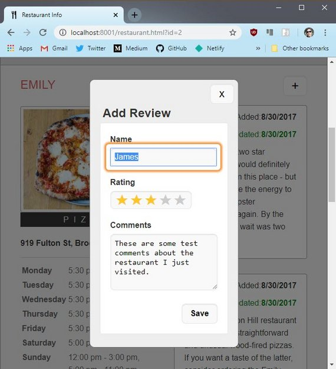](assets/images/3-8.jpg)
**Figure 8:** Form with Screen Reader

#### Form Validation
This is the form with intrinsic HTML5 validation.

[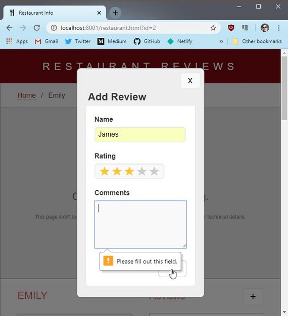](assets/images/3-9.jpg)
**Figure 9:** Form Validation

## 6. Restaurants Store
Right now we're using IndexedDB to store our restaurant data. Since we're now querying our restaurant data from a local copy, we have the following benefits.

- saves us round-trips from the server
- allows us to provide an offline experience

### 6.1 Previous Schema
Previously all restaurant records were saved as a single large json file under a single key of 'restaurants'.

[](assets/images/2-13.jpg)
**Figure 10:** Old object store schema

This was fine for stage 2 of our project since each of our methods worked against the entire dataset.  Now in stage 3 we need more granular access and control of our data.

### 6.2 New schema
In order better represent the data within our local IndexedDB store we've now separated each restaurant into it's own record.

[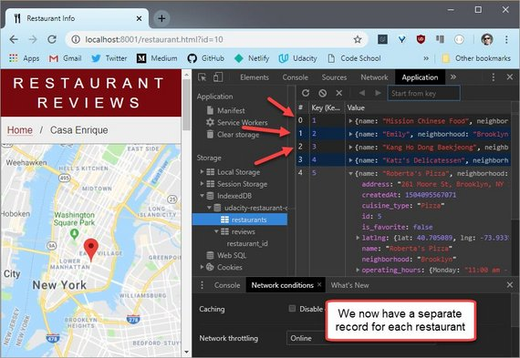](assets/images/3-11.jpg)
**Figure 11:** New object store schema

This has the benefit of allowing us to update each restaurant individually without having to rebuild the entire dataset.

This will come in handy when we need to update a restaurant's "favorite" status.

### 6.3 Updated IDB Code
In order to break out the restaurants so that each is given it's own IDB record, we needed to loop through the `restaurants` json.

This is done in the service worker code (`sw.js`).

We first start by looking at the code to intercept all fetch requests. If a call includes port 1337 then it's a request for restaurant data from the database.

#### sw.js

```js
// intercept all requests
// return cached asset, idb data, or fetch from network
self.addEventListener('fetch', event => {
  const request = event.request;
  const requestUrl = new URL(request.url);
  
  // 1. filter Ajax Requests
  if (requestUrl.port === '1337') {
    event.respondWith(idbRestaurantResponse(request));
  }
  else {
    event.respondWith(cacheResponse(request));
  }
});
```

In this case we follow that to the `idbRestaurantResponse` function.

```js
let j = 0;
function idbRestaurantResponse(request, id) {
  // 1. getAll records from objectStore
  // 2. if more than 1 rec then return match
  // 3. if no match then fetch json, write to idb, & return response

  return idbKeyVal.getAll('restaurants')
    .then(restaurants => {
      if (restaurants.length) {
        return restaurants;
      }
      return fetch(request)
        .then(response => response.json())
        .then(json => {
          json.forEach(restaurant => {  // <- this line loops thru the json
            console.log('fetch idb write', ++j, restaurant.id, restaurant.name);
            idbKeyVal.set('restaurants', restaurant); // <- writes each record
          });
          return json;
        });
    })
    .then(response => new Response(JSON.stringify(response)))
    .catch(error => {
      return new Response(error, {
        status: 404,
        statusText: 'my bad request'
      });
    });
}
```

The only other new piece of code is the `getAll` method on our `idbKeyVal` object literal.  This returns the whole record set for an object store.

```js
// IndexedDB object with get, set, getAll, & getAllIdx methods
// https://github.com/jakearchibald/idb
const idbKeyVal = {
  get(store, key) {
    return dbPromise.then(db => {
      return db
        .transaction(store)
        .objectStore(store)
        .get(key);
    });
  },
  getAll(store) {
    return dbPromise.then(db => {
      return db
        .transaction(store)
        .objectStore(store)
        .getAll();
    });
  },
  set(store, val) {
    return dbPromise.then(db => {
      const tx = db.transaction(store, 'readwrite');
      tx.objectStore(store).put(val);
      return tx.complete;
    });
  }
};
```

## 7. Refactor IDB Code
It became clear I'll need to do IDB operations from places other than just the service worker. So, I decided to create a separate js file to contain my IDB code.

The new file (`idbhelper.js`) is then be bundled along with my service worker (`sw.js`) and my restaurants js file (`restaurant_info.js`) through a set of gulp tasks.

### 7.1 Create new js for IDB
First thing is to move the following code out of `sw.js` to its own `idbhelper.js` file.

#### idbhelper.js

```js
import idb from 'idb';
// let idb = require('idb');

const dbPromise = idb.open('udacity-restaurant-db', 1, upgradeDB => {
  switch (upgradeDB.oldVersion) {
    case 0:
      upgradeDB.createObjectStore('restaurants', 
        { keyPath: 'id', unique: true });
  }
});

// IndexedDB object with get, set, getAll, & getAllIdx methods
// https://github.com/jakearchibald/idb
const idbKeyVal = {
  get(store, key) {
    return dbPromise.then(db => {
      return db
        .transaction(store)
        .objectStore(store)
        .get(key);
    });
  },
  getAll(store) {
    return dbPromise.then(db => {
      return db
        .transaction(store)
        .objectStore(store)
        .getAll();
    });
  },
  set(store, val) {
    return dbPromise.then(db => {
      const tx = db.transaction(store, 'readwrite');
      tx.objectStore(store).put(val);
      return tx.complete;
    });
  }
};

self.idbKeyVal = idbKeyVal;   // <- This line exposes the object literal.
```

The line `self.idbKeyVal = idbKeyVal;` is key!

The reason is that we are using Browserify in our Gulpfile to bundle the idb library referenced in the first line (`import idb from 'idb';`).

Browserify wraps our code in an Immediately Invoked Function Expression (IIFE) in order to not pollute the global namespace.

This means we lose our ability to reference the object literal from any code outside this bundle.

### 7.2 Update Gulp Tasks
Next I added to the `sw` task. It previously was just processing the `sw.js` file and bundling the `idb` library referenced within it.

Now it combines `sw.js` with `idbhelper.js` as well.

#### gulpfile.js

```js
// Service Worker
gulp.task('sw', function () {
  var bundler = browserify([
    './app/js/idbhelper.js',
    './app/sw.js'
  ], { debug: false }); // ['1.js', '2.js']

  return bundler
    .transform(babelify, {sourceMaps: false})  // required for 'import'
    .bundle()               // concat
    .pipe(source('sw.js'))  // get text stream w/ destination filename
    .pipe(buffer())         // required to use stream w/ other plugins
    .pipe(gulp.dest('.tmp'));
});
```

The next thing I did was create a `dbhelper` task in order to bundle `dbhelper.js` with `idbhelper.js` and the `idb` library.

```js
// DBHelper
gulp.task('dbhelper', function () {
  var bundler = browserify([
    './app/js/idbhelper.js',
    './app/js/dbhelper.js'
  ], { debug: false }); // ['1.js', '2.js']

  return bundler
    .transform(babelify, {sourceMaps: false})  // required for 'import'
    .bundle()               // concat
    .pipe(source('dbhelper.min.js'))  // get text stream w/ dest filename
    .pipe(buffer())         // required to use stream w/ other plugins
    .pipe(gulp.dest('.tmp/js/'));
});
```

### 7.3 Update DBHelper Class
Since Browserify wraps the `DBHelper` class in an IIFE we also need to make sure to expose the class in the global namespace.

This is done with the following...

#### dbhelper.js

```js
class DBHelper {}
  // existing code...
}

window.DBHelper = DBHelper;   // <- exposes DBHelper on window (global) object
```

This makes `DBHelper` available off of the `window` object which is necessary for any access by other scripts defined outside of the Browserify bundle.

### 7.4 Update HTML files
Lastly, I had to make a small change to both `index.html` & `restaurant.html`.

I needed to move the `dbhelper.js` script to it's own line and out of "build" section which gulp uses to know which files to combine.

This is because dbhelper uses `import` to include dependent libraries which I couldn't successfully combine with the rest of the javascript build process.

#### index.html (before change)

```html
<!-- build:js js/index.min.js defer -->
<script src="js/dbhelper.js"></script>
<script src="js/register_sw.js"></script>
<script src="js/main.js"></script>
<!-- endbuild -->
```

#### index.html (after change)

```html
<script src="js/dbhelper.min.js"></script>
<!-- build:js js/index.min.js defer -->
<script src="js/register_sw.js"></script>
<script src="js/main.js"></script>
<!-- endbuild -->
```

#### index.html (after build)
What this does is create two script references in the HTML for final build.

```html
<html>
  <body>
    <script src=js/dbhelper.min.js></script>
    <script src=js/index.min.js defer></script>
  </body>
</html>
```

This does end up adding another server request when the page first loads but we can get around this this by creating a gulp task to inline the js code for final production builds.

## 8. Reviews Store
### 8.1 Create Review Store
In order to be able to access reviews when offline we need to cache them to a new local IndexedDB object store.

We've moved our IDB code to it's own `idbhelper.js` file. Here's where we'll upgrade the database to create a `reviews` store with an auto-incrementing id.

The auto-incrementing id will be necessary when designing offline use capability.

We also create an index on `restaurant_id` so we can easily query all reviews for a given restaurant.

#### idbhelper.js

```js
const dbPromise = idb.open('udacity-restaurant-db', 2, upgradeDB => {
  switch (upgradeDB.oldVersion) {
    case 0:
      upgradeDB.createObjectStore('restaurants',
        { keyPath: 'id', unique: true });
    case 1:
      const reviewStore = upgradeDB.createObjectStore('reviews',
        { autoIncrement: true });
      reviewStore.createIndex('restaurant_id', 'restaurant_id');
  }
});
```

Once this is done we add a new method to our `idbKeyVal` object literal. This will allow us to get all reviews based on a reataurant.

```js
const idbKeyVal = {
  get...
  getAll...
  getAllIdx(store, idx, key) {
    return dbPromise.then(db => {
      return db
        .transaction(store)
        .objectStore(store)
        .index(idx)
        .getAll(key);
    });
  },
  set...
}
```

### 8.2 Fill Review Store
Next we'll add another condition to our fetch event listener which will trap the call for a restaurant's reviews.

We'll then do an `event.respondWith()` with a call to `idbReviewResponse` function.

#### sw.js

```js
// intercept all requests
// return cached asset, idb data, or fetch from network
self.addEventListener('fetch', event => {
  const request = event.request;
  const requestUrl = new URL(request.url);
  
  // 1. filter Ajax Requests
  if (requestUrl.port === '1337') {
    if (request.url.includes('reviews')) {                    // <- new
      let id = +requestUrl.searchParams.get('restaurant_id'); // <- new
      event.respondWith(idbReviewResponse(request, id));      // <- new
    } else {                                                  // <- new
      event.respondWith(idbRestaurantResponse(request));
    }
  }
  else {
    event.respondWith(cacheResponse(request));
  }
});
```

Next we create the `idbReviewResponse` function. This works like our previous `idbRestaurantResponse` function.

It queries the `reviews` object store. If it gets any records back it sends that result set to the calling function.

If it doesn't it performs a fetch to get the reviews from the server. It then loops through these and fills the `reviews` object store before returning the json response back to the calling function.

```js
let k = 0;
function idbReviewResponse(request, id) {
  return idbKeyVal.getAllIdx('reviews', 'restaurant_id', id)
    .then(reviews => {
      if (reviews.length) {
        return reviews;
      }
      return fetch(request)
        .then(response => response.json())
        .then(json => {
          json.forEach(review => {
            console.log('fetch idb review write', ++k, review.id, review.name);
            idbKeyVal.set('reviews', review);
          });
          return json;
        });
    })
    .then(response => new Response(JSON.stringify(response)))
    .catch(error => {
      return new Response(error, {
        status: 404,
        statusText: 'my bad request'
      });
    });
}
```

### 8.3 Inspect Data
Now that we have the object store in place it'll get filled with review data as we navigate through the various restaurant detail pages.

#### Reviews object store
[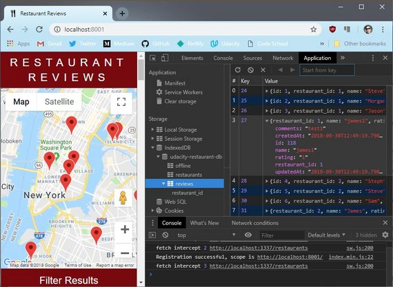](assets/images/3-12.jpg)
**Figure 12:** Reviews object store

The `reviews` object store shows up and is capturing data properly.

#### Reviews index
The `restaurant_id` index is simply another view of the data in the object store. It allows us to do a query using the `getAllIdx` method of the `idbKeyVal` object.

[](assets/images/3-13.jpg)
**Figure 13:** Reviews Index

 The `restaurant_id` index also displays properly.

## 9. Offline Reviews
This next section covers how the application must work offline. The app must:

- Allow user to add reviews while offline
  - Review will be visible locally while app is disconnected
  - `createIDBReview` method will write to the `reviews` store
  - New `offline` object store will keep track of attempted requests
  - `addRequestToQueue` method will write requests to `offline` store

### 9.1 Create Offline Store
The first step is to create the `offline` object store.

#### idbhelper.js

```js
const dbPromise = idb.open('udacity-restaurant-db', 3, upgradeDB => {
  switch (upgradeDB.oldVersion) {
    case 0:
      upgradeDB.createObjectStore('restaurants',
        { keyPath: 'id', unique: true });
    case 1:
      const reviewStore = upgradeDB.createObjectStore('reviews',
        { autoIncrement: true });
      reviewStore.createIndex('restaurant_id', 'restaurant_id');
    case 2:
      upgradeDB.createObjectStore('offline',
        { autoIncrement: true });
  }
});
```

While in this file I also need to add a new IDB method for getting the primary key back after setting a value.

This is necessary for replacing records that were created while offline once the app re-connects.

#### idbhelper.js

```js
const idbKeyVal = {
  get...
  getAll...
  getAllIdx...
  set...
  setReturnId(store, val) {
    return dbPromise.then(db => {
      const tx = db.transaction(store, 'readwrite');
      const pk = tx
        .objectStore(store)
        .put(val);
      tx.complete;
      return pk;
    });
  }
}
```

### 9.2 Save Review
The `saveAddReview` FE handler is invoked once the "Save" button is clicked on the Add Review form.

It checks for form validity and then calls `DBHelper.createRestaurantReview` which attempts to write the record to DB.

#### restaurant_info.js

```js
const saveAddReview = (e) => {
  e.preventDefault();
  const form = e.target;

  if (form.checkValidity()) {
    console.log('is valid');

    const restaurant_id = self.restaurant.id;
    const name = document.querySelector('#reviewName').value;
    const rating = document.querySelector('input[name=rate]:checked').value;
    const comments = document.querySelector('#reviewComments').value;
  
    // attempt save to database server
    DBHelper.createRestaurantReview(restaurant_id, name, rating, comments,
      (error, review) => {
      console.log('got callback');
      form.reset();
      if (error) {
        console.log('We are offline. Review has been saved to the queue.');
        window.location.href =
          `/restaurant.html?id=${self.restaurant.id}&isOffline=true`;
      } else {
        console.log('Received updated record from DB Server', review);
        DBHelper.createIDBReview(review); // write record to local IDB store
        window.location.href = `/restaurant.html?id=${self.restaurant.id}`;
      }
    });
  }
};
```

### 9.3 CreateRestaurantReview
`CreateRestaurantReview` takes a review and does a number of things...

1. It formats the server request
2. Attempts to POST the data with fetch
3. If successful it returns the data to the calling function
4. If offline it saves the review to local idb & gets the review_key back
5. It saves the request to the offline store along with the review_key

#### dbhelper.js

```js
static createRestaurantReview(restaurant_id, name, rating, comments, callback) {
  const url = DBHelper.DATABASE_URL + '/reviews/';
  const headers = { 'Content-Type': 'application/form-data' };
  const method = 'POST';
  const data = {
    restaurant_id: restaurant_id,
    name: name,
    rating: +rating,
    comments: comments
  };
  const body = JSON.stringify(data);
  // const body = data;

  fetch(url, {
    headers: headers,
    method: method,
    body: body
  })
    .then(response => response.json())
    .then(data => callback(null, data))
    .catch(err => {
      // We are offline...
      // Save review to local IDB
      DBHelper.createIDBReview(data)
        .then(review_key => {
          // Get review_key and save it with review to offline queue
          console.log('returned review_key', review_key);
          DBHelper.addRequestToQueue(url, headers, method, data, review_key)
            .then(offline_key => console.log('offline_key', offline_key));
        });
      callback(err, null);
    });
}
```

### 9.4 CreateIDBReview
`createIDBReview` writes the review record to the local `reviews` object store.

It's called after successfully writing the record to the server DB and it's called after an unsuccessful attempt.

Either way, the review is saved locally.

#### dbhelper.js

```js
static createIDBReview(review) {
  return idbKeyVal.setReturnId('reviews', review)
    .then(id => {
      console.log('Saved to IDB: reviews', review);
      return id;
    });
}
```

### 9.5 AddRequestToQueue
If the fetch request (POST) fails then it means we are offline and the request is written to the `offline` object store for processing later.

#### dbhelper.js

```js
static addRequestToQueue(url, headers, method, data, review_key) {
  const request = {
    url: url,
    headers: headers,
    method: method,
    data: data,
    review_key: review_key
  };
  return idbKeyVal.setReturnId('offline', request)
    .then(id => {
      console.log('Saved to IDB: offline', request);
      return id;
    });
}
```

### 9.6 Offline Alert UI & ARIA
The code (shown in the next section) reloads the page and displays the offline alert.

The alert html looks like this.

#### index.html & restaurant.html

```html
<html>
  <body>
  <!-- other html -->
  
  <div id="offline" role="alert" aria-hidden="true">
    <h3>Offline - not connected to the internet</h3>
    <p>Your review has been saved and will post once
      the connection is reestablished.</p>
  </div>

  <!-- scripts -->
  </body>
</html>
```

The `role="alert"` tells screen readers that this is a brief, important message that attracts the users attention without interrupting the user's task.

The `aria-hidden="true"` attribute hides the element from assistive technologies until we trigger it through code to display.

This is styled with the following CSS.

#### styles.css

```css
#offline {
  position: fixed;
  align-self: center;
  justify-self: center;
  top: -120px;
  background-color: #f3df84;
  border-bottom: 1px solid #999;
  border-left: 1px solid #999;
  border-right: 1px solid #999;
  padding: 10px 16px;
  margin: 0 auto;
  border-bottom-left-radius: 10px;
  border-bottom-right-radius: 10px;
  max-width: 400px;
  transition: top .3s ease-in-out 1s;
}
#offline.show {
  top: 0;
}
#offline h3 {
  margin: 0 0 6px;
}
#offline p {
  margin: 0 0 10px;
}
```

The CSS fixes and positions the alert off-screen. We also have a transition in place so it'll animate down when the `.show` class is added to `<div id="#offline">`.

### 9.7 Offline Alert JS
If we're offline, the POST to save the review will fail. `saveAddReview` catches this error which is returned on the callback.

It then appends `isOffline=true` to the QueryString before reloading the page.

#### restaurant_info.js

```js
const saveAddReview = (e) => {
  // other code...

  if (form.checkValidity()) {
    // attempt save to database server
    DBHelper.createRestaurantReview(restaurant_id, name, rating, comments,
      (error, review) => {
      console.log('got callback');
      form.reset();
      if (error) {
        console.log('We are offline. Review has been saved to the queue.');
        window.location.href =
          `/restaurant.html?id=${self.restaurant.id}&isOffline=true`; // <-here
      } else {
        console.log('Received updated record from DB Server', review);
        DBHelper.createIDBReview(review); // write record to local IDB store
        window.location.href = `/restaurant.html?id=${self.restaurant.id}`;
      }
    });
  }
}
```

I then added a `load` EventListener to display the alert if the `isOffline` parameter is present in the URL.

#### index.html & restaurant_info.js

```js
window.addEventListener('load', function () {
  const isOffline = getParameterByName('isOffline');

  if (isOffline) {
    document.querySelector('#offline').setAttribute('aria-hidden', false);
    document.querySelector('#offline').classList.add('show');

    wait(8000).then(() => {
      document.querySelector('#offline').setAttribute('aria-hidden', true);
      document.querySelector('#offline').classList.remove('show');
    });
  }

  function wait(ms) {
    return new Promise(function (resolve, reject) {
      window.setTimeout(function () {
        resolve(ms);
        reject(ms);
      }, ms);
    });
  }
});
```

If offline we un-hide the alert from assistive technologies and add the `show` class to the alert.

We then wait 8 seconds before hiding the alert once again.

[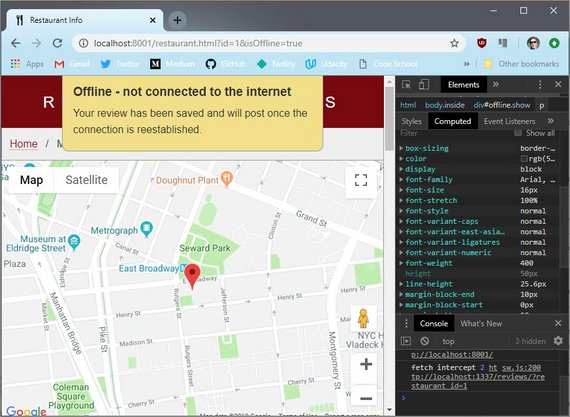](assets/images/3-14.jpg)
**Figure 14:** Offline Alert

## 10. POST Offline Data
This section breaks down the code that updates the server with data generated while offline. This includes:

- Send review to the server when connectivity is re-established
  - `window` object's `load` event will be used to trigger `processQueue` method
  - `processQueue` will iterate through the request records to update the server
  - each successful POST will remove the POST request from the queue
  - each successful POST will update the review record with new server data

### 10.1 Process Queue
In order to process the data we need a `processQueue` method.

It does the following:

1. On page load it gets the all offline requests as a cursor
2. It opens the first request and attempts to POST it with fetch
3. If we are offline then it skips to the next and tries again
4. Once we do successfully POST we get the resulting record back
5. We then delete the offline request from the offline store
6. We add the new review record and delete the old record from reviews store
7. The add & delete is done in the same transaction so if it fails it rolls back

#### dbhelper.js

```js
static processQueue() {
  // Open offline queue & return cursor
  dbPromise.then(db => {
    if (!db) return;
    const tx = db.transaction(['offline'], 'readwrite');
    const store = tx.objectStore('offline');
    return store.openCursor();
  })
    .then(function nextRequest (cursor) {
      if (!cursor) {
        console.log('cursor done.');
        return;
      }
      console.log('cursor', cursor.value.data.name, cursor.value.data);

      const offline_key = cursor.key;
      const url = cursor.value.url;
      const headers = cursor.value.headers;
      const method = cursor.value.method;
      const data = cursor.value.data;
      const review_key = cursor.value.review_key;
      const body = JSON.stringify(data);

      // update server with HTTP POST request & get updated record back        
      fetch(url, {
        headers: headers,
        method: method,
        body: body
      })
        .then(response => response.json())
        .then(data => {
          // data is returned record
          console.log('Received updated record from DB Server', data);
          // test if this is a review or favorite update

          // 1. Delete http request record from offline store
          dbPromise.then(db => {
            const tx = db.transaction(['offline'], 'readwrite');
            tx.objectStore('offline').delete(offline_key);
            return tx.complete;
          })
            .then(() => {
              // 2. Add new review record to reviews store
              // 3. Delete old review record from reviews store 
              dbPromise.then(db => {
                const tx = db.transaction(['reviews'], 'readwrite');
                return tx.objectStore('reviews').put(data)
                  .then(() => tx.objectStore('reviews').delete(review_key))
                  .then(() => {
                    console.log('tx complete reached.');
                    return tx.complete;
                  })
                  .catch(err => {
                    tx.abort();
                    console.log('transaction error: tx aborted', err);
                  });
              })
                .then(() => console.log('review transaction success!'))
                .catch(err => console.log('reviews store error', err));
            })
            .then(() => console.log('offline rec delete success!'))
            .catch(err => console.log('offline store error', err));
        }).catch(err => {
          console.log('fetch error. we are offline.');
          console.log(err);
          return;
        });
      return cursor.continue().then(nextRequest);
    })
    .then(() => console.log('Done cursoring'))
    .catch(err => console.log('Error opening cursor', err));
}
```

### 10.2 Window load Event
We need to trigger the `processQueue` method from both the index page and the restaurant details page.

#### restaurant_info.js

```js
window.addEventListener('load', function () {
  const isOffline = getParameterByName('isOffline');

  if (isOffline) {
    document.querySelector('#offline').setAttribute('aria-hidden', false);
    document.querySelector('#offline').classList.add('show');

    wait(8000).then(() => {
      document.querySelector('#offline').setAttribute('aria-hidden', true);
      document.querySelector('#offline').classList.remove('show');
    });
  }

  DBHelper.processQueue();
});
```

main.js doesn't have the `getParameterByName` method that `restaurant_info.js` has so I just copied it over.

Ideally, we'd move it to a js file that would be bundled and included on both pages while just existing in one file.

#### main.js

```js
window.addEventListener('load', function () {
  const isOffline = getParameterByName('isOffline');

  if (isOffline) {
    document.querySelector('#offline').setAttribute('aria-hidden', false);
    document.querySelector('#offline').classList.add('show');

    wait(8000).then(() => {
      document.querySelector('#offline').setAttribute('aria-hidden', true);
      document.querySelector('#offline').classList.remove('show');
    });
  }

  DBHelper.processQueue();
});

/**
 * Get a parameter by name from page URL.
 */
const getParameterByName = (name, url) => {
  if (!url)
    url = window.location.href;
  // name = name.replace(/[\[\]]/g, '\\$&');
  name = name.replace(/[[\]]/g, '\\$&');
  const regex = new RegExp(`[?&]${name}(=([^&#]*)|&|#|$)`),
    results = regex.exec(url);
  if (!results)
    return null;
  if (!results[2])
    return '';
  return decodeURIComponent(results[2].replace(/\+/g, ' '));
};
```

### 10.3 Test Results
Now that the code is in place we can test. We start by going to the network panel and selecting the 'offline' checkbox

Now that we're disconnected we can add a review.

[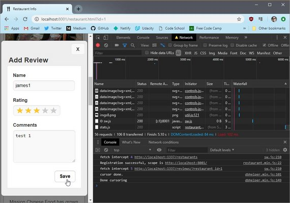](assets/images/3-17.jpg)
**Figure 15:** Add review while offline

The record is added to the offline object store.

The record is a formatted HTTP request that is easily passed to fetch once we have a working connection.

[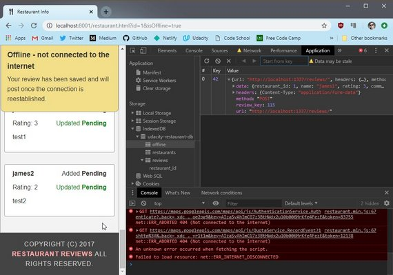](assets/images/3-15.jpg)
**Figure 16:** Review Added

Here we see the connection is now working, the debug code displays success, and the record is in the IndexedDB store.

[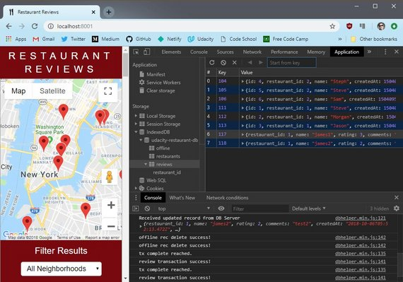](assets/images/3-16.jpg)
**Figure 17:** Review Added

When we navigate back to the restaurant reviews page we can see our new reviews displayed.

[](assets/images/3-18.jpg)
**Figure 18:** Reviews displayed


<!-- 
### 10.1 Task for Inlining Code
As a last step I created a Gulp task that takes both external css & javascript files and inlines them in the HTML.

This is done in order improve the DevTools Performance score.

```js
gulp.task('inline1', function () {
  return gulp
    .src('./dist/index.html')
    .pipe(
      $.stringReplace('<link rel=stylesheet href=css/styles.css>', function(s) {
        var style = fs.readFileSync("dist/css/styles.css", "utf8");
        return "<style>" + style + "</style>";
      })
    )
    .pipe(
      $.stringReplace('<script src=js/dbhelper.min.js></script>', function(s) {
        var script = fs.readFileSync('dist/js/dbhelper.min.js', 'utf8');
        return '<script>' + script + '</script>';
      })
    )
    // .pipe(minify())
    .pipe(gulp.dest("dist/"));
});

gulp.task('inline2', function () {
  return gulp
    .src('./dist/restaurant.html')
    .pipe(
      $.stringReplace('<link rel=stylesheet href=css/styles.css>', function(s) {
        var style = fs.readFileSync("dist/css/styles.css", "utf8");
        return "<style>" + style + "</style>";
      })
    )
    .pipe(
      $.stringReplace('<script src=js/dbhelper.min.js></script>', function(s) {
        var script = fs.readFileSync('dist/js/dbhelper.min.js', 'utf8');
        return '<script>' + script + '</script>';
      })
    )
    // .pipe(minify())
    .pipe(gulp.dest("dist/"));
});
```
 -->